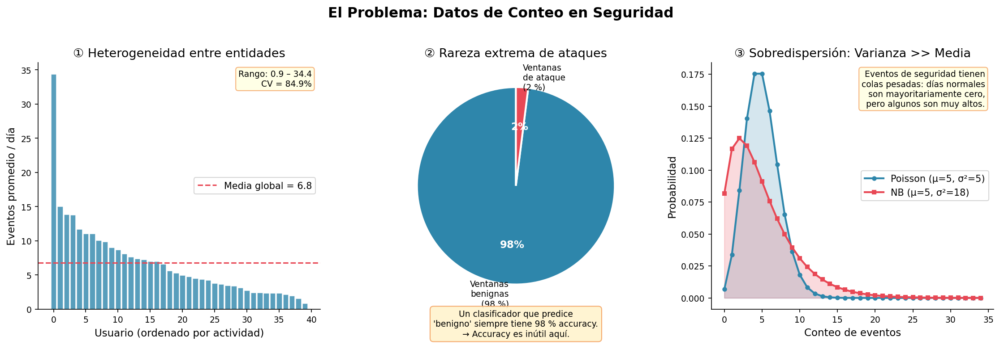
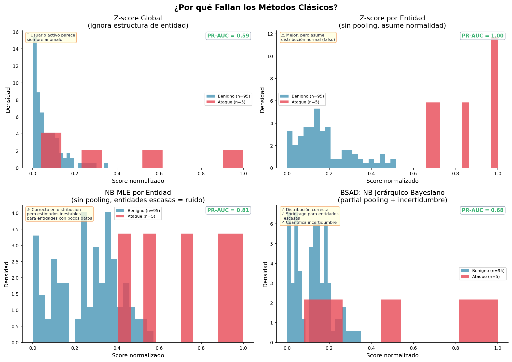
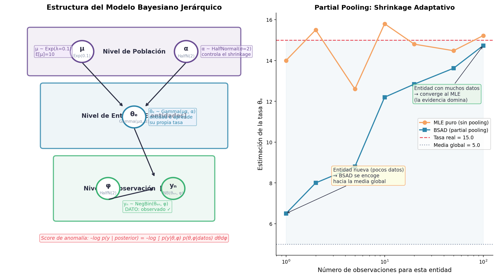
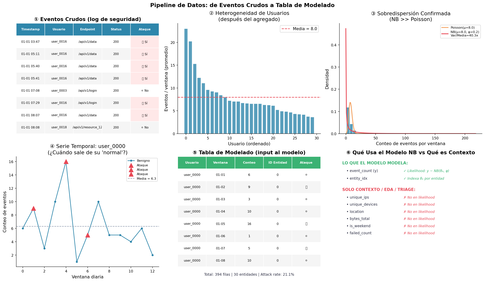
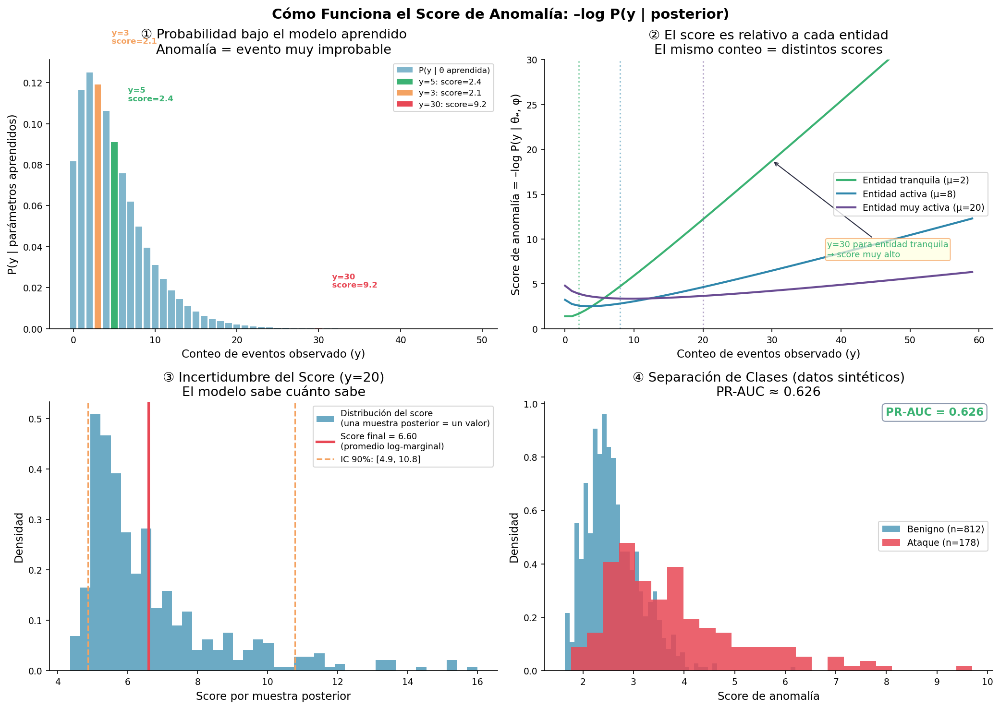
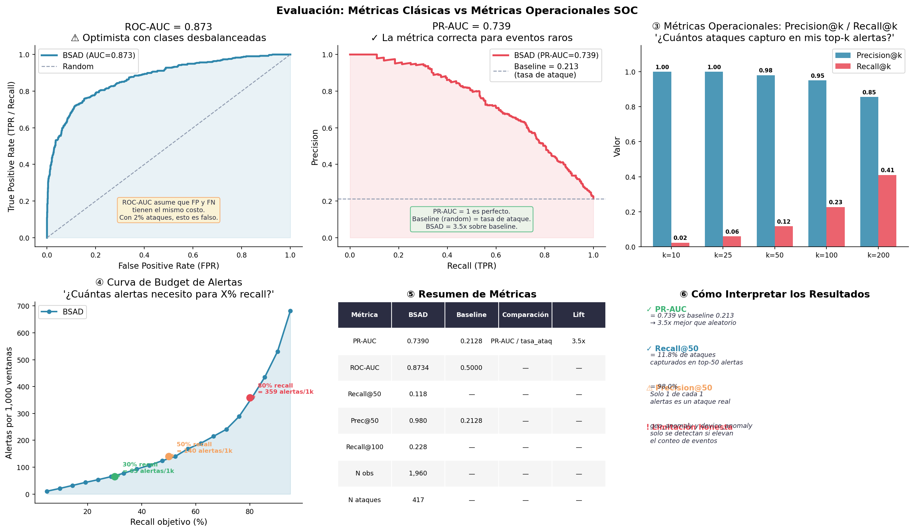
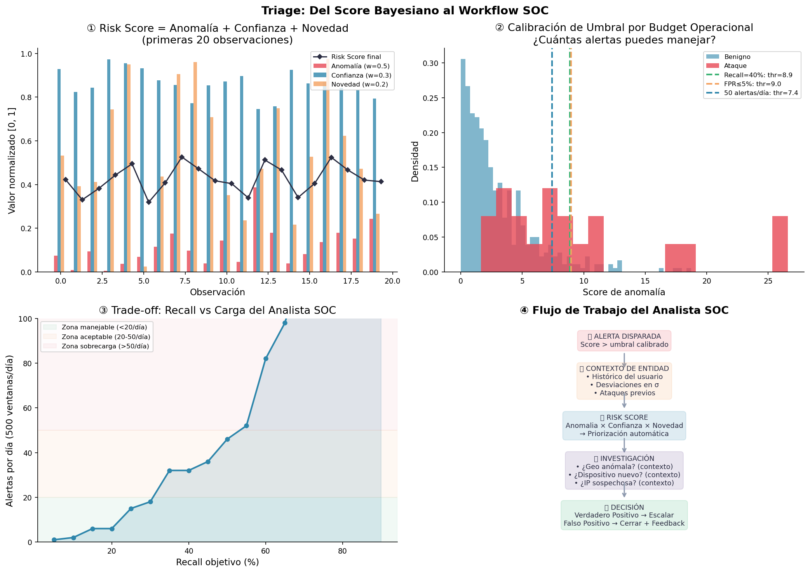
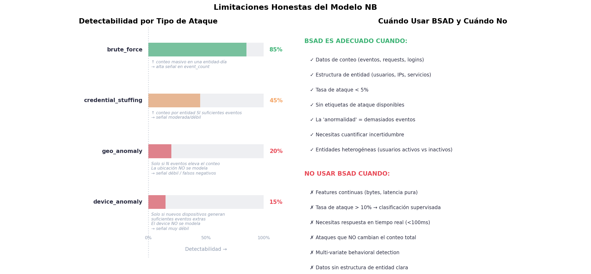

# BSAD — Explicación Profunda del Sistema

> **Genera todos los gráficos de este documento con:**
> ```bash
> conda activate bsad
> python scripts/explain_pipeline.py --output outputs/explanation
> ```

---

## Índice

1. [El Problema: ¿Por qué los datos de seguridad son difíciles?](#1-el-problema)
2. [Por qué fallan los métodos clásicos](#2-por-qué-fallan-los-métodos-clásicos)
3. [La solución: Modelo Bayesiano Jerárquico NB](#3-la-solución-modelo-bayesiano-jerárquico-nb)
4. [El pipeline de datos paso a paso](#4-el-pipeline-de-datos-paso-a-paso)
5. [Cómo funciona el scoring de anomalías](#5-cómo-funciona-el-scoring-de-anomalías)
6. [Evaluación: métricas clásicas vs operacionales](#6-evaluación-métricas-clásicas-vs-operacionales)
7. [Triage: del score al workflow SOC](#7-triage-del-score-al-workflow-soc)
8. [Limitaciones honestas](#8-limitaciones-honestas)
9. [Arquitectura del código](#9-arquitectura-del-código)
10. [Próximos pasos y extensiones](#10-próximos-pasos-y-extensiones)

---

## 1. El Problema



Los datos de logs de seguridad tienen **tres características** que hacen que la mayoría de los detectores de anomalías fallen:

### ① Heterogeneidad extrema entre entidades

Cada usuario tiene un comportamiento distinto. El usuario `user_0001` puede generar 2 eventos por día de media, mientras que `user_0050` genera 80. Un conteo de 20 eventos es completamente normal para uno y altamente sospechoso para el otro.

**El error más común:** usar un único umbral global ("todo lo que supere 15 eventos es sospechoso") produce:
- **Falsos positivos masivos** en usuarios activos legítimos
- **Falsos negativos** en usuarios poco activos que sufren un ataque pequeño

### ② Rareza extrema de los ataques

Los ataques reales representan típicamente **< 2–5 % de las ventanas de observación**. Esta asimetría tiene consecuencias matemáticas importantes:

- Un clasificador que siempre predice "benigno" tiene **98 % de accuracy**. La accuracy es inútil.
- Las métricas de evaluación deben adaptarse: **PR-AUC** es mucho más informativa que ROC-AUC en este contexto (explicado en §6).
- Los modelos que no están diseñados para desbalanceo se sesgan hacia la clase mayoritaria.

### ③ Sobredispersión: la varianza es mucho mayor que la media

En datos de seguridad, la distribución de eventos por ventana no sigue una distribución de Poisson (donde varianza = media). La varianza real puede ser **3–20x mayor que la media**.

```
Poisson: P(y) asume Var = μ
Realidad: Var >> μ  →  distribución Negative Binomial (NB)
```

Si fuerzas un modelo Poisson en datos sobredispersos, **subestimas la probabilidad de eventos altos y generas demasiadas alertas falsas.**

El modelo BSAD usa explícitamente la distribución Negative Binomial, que tiene un parámetro adicional `φ` (phi) para controlar la sobredispersión.

---

## 2. Por qué fallan los métodos clásicos



### Z-score global
```
score(y) = (y - μ_global) / σ_global
```
**Problema:** usa la media y desviación de *todos* los usuarios. Un usuario muy activo siempre tendrá Z-scores altos, aunque esté completamente dentro de su comportamiento normal. Es un detector de "usuarios activos", no de "comportamiento anómalo".

### Z-score por entidad
```
score(y, e) = (y - μ_e) / σ_e
```
Mejor, pero:
1. **Asume distribución normal** — los conteos son enteros no negativos con cola pesada, no normales.
2. **Estimación inestable** — un usuario con 5 observaciones tiene estimaciones de media y desviación muy ruidosas.
3. **No cuantifica incertidumbre** — un Z-score de 3.0 para un usuario con 3 observaciones es igual de "confiado" que para uno con 300 observaciones. Esto es incorrecto.

### NB-MLE por entidad (sin pooling)
```
θ̂_e = argmax P(y₁, ..., yₙ | θ_e)   [independiente por entidad]
```
Correcto en la distribución (usa NB), pero:
1. **Sin información compartida:** si un usuario tiene 3 observaciones, el MLE es inestable. Una sola observación atípica en el conjunto de entrenamiento distorsiona toda la estimación.
2. **Problema de cold start:** entidades nuevas (0–5 observaciones) producen estimaciones muy ruidosas. Un día con 10 eventos cuando el MLE estimó 2 puede no ser un ataque, sino simplemente ruido de estimación.

### BSAD: Bayesiano Jerárquico (la solución)
Combina lo mejor de los dos mundos: **usa datos de todas las entidades para mejorar la estimación de cada entidad**, pero permite que cada una tenga su propio baseline.

---

## 3. La solución: Modelo Bayesiano Jerárquico NB



### La ecuación completa

```
NIVEL DE POBLACIÓN (priors — lo que sabemos antes de ver datos):
  μ   ~ Exponential(λ = 0.1)          → tasa media de eventos (media=10)
  α   ~ HalfNormal(σ = 2.0)           → concentración (controla el pooling)

NIVEL DE ENTIDAD (partial pooling):
  θ_e ~ Gamma(α = μ·α, β = α)         → tasa específica de la entidad e

NIVEL DE OBSERVACIÓN (likelihood):
  φ   ~ HalfNormal(σ = 2.0)           → sobredispersión global
  y_n ~ NegativeBinomial(μ = θ_{e_n}, α = φ)    → conteo observado
```

### ¿Qué significa cada variable?

| Variable | Significado | ¿Quién la aprende? |
|---|---|---|
| `μ` | Tasa media de eventos de toda la organización | El modelo durante MCMC |
| `α` | Qué tan concentradas son las tasas entre entidades | El modelo durante MCMC |
| `θ_e` | La tasa "normal" específica de la entidad `e` | El modelo por cada entidad |
| `φ` | Cuánta variabilidad extra hay (sobredispersión) | El modelo durante MCMC |
| `y_n` | El conteo observado en la ventana `n` | **Dato de entrada** |

### El concepto clave: Partial Pooling (shrinkage)

Este es el corazón del método. Para cada entidad `e`:

```
θ_e aprende de:
  ├── Sus propios datos (observaciones de esa entidad)
  └── Datos de TODAS las entidades (via μ y α)

La proporción depende de cuántos datos tenga la entidad:
  ┌─ Pocos datos (entidad nueva)   → θ_e ≈ μ (se acerca a la media global)
  └─ Muchos datos (entidad madura) → θ_e ≈ MLE_e (sus propios datos dominan)
```

**Ejemplo concreto:**
- La media global es `μ = 5` eventos/día
- Usuario nuevo (`user_new`) tiene solo 2 observaciones: [3, 4]
  - **MLE puro:** θ̂ = 3.5 (inestable, basado en 2 puntos)
  - **BSAD:** θ̂ ≈ 4.8 (encogido hacia μ=5 porque hay poca evidencia)
- Usuario maduro (`user_old`) tiene 100 observaciones con media 15
  - **MLE puro:** θ̂ = 15.0
  - **BSAD:** θ̂ ≈ 14.8 (casi igual, la evidencia domina)

### ¿Qué es MCMC?

El modelo tiene una distribución posterior `P(μ, α, θ₁..θₑ, φ | datos)` que no tiene forma analítica. MCMC (Markov Chain Monte Carlo) la **muestrea**.

```
MCMC produce:
  - S muestras: {(μ^(s), α^(s), θ₁^(s), ..., φ^(s))} para s = 1..S

Cada muestra es una hipótesis completa sobre cómo se generaron los datos.
El conjunto de muestras aproxima la distribución posterior completa.
```

Con PyMC y el sampler NUTS (No-U-Turn Sampler):
- `n_tune = 1000` pasos de calentamiento (descartados)
- `n_draws = 2000` muestras por cadena
- `n_chains = 4` cadenas paralelas
- Total: **8,000 muestras posteriores** para scoring

---

## 4. El pipeline de datos paso a paso



### Paso 1: Eventos crudos

Los datos de entrada son logs de seguridad **a nivel de evento individual**:

```
timestamp           user_id     ip_address  endpoint        status  is_attack
2024-01-15 09:23    user_0042   ip_0017     /api/v1/login   200     False
2024-01-15 09:24    user_0042   ip_0017     /api/v1/data    200     False
2024-01-15 14:01    user_0042   ip_9999     /api/v1/login   401     True   ← ataque
...
```

**Una fila = un evento de seguridad.**

### Paso 2: Agregado por ventanas temporales

```python
# Agrupa por (usuario, día) y cuenta eventos
modeling_df = create_time_windows(events_df, FeatureConfig(window_size="1D"))
```

```
user_id     window      event_count  unique_ips  has_attack  attack_type
user_0042   2024-01-15  47           3           True        brute_force
user_0042   2024-01-16  4            1           False       none
user_0001   2024-01-15  3            1           False       none
...
```

**Una fila = una entidad-ventana.** Esta es la unidad de análisis.

> **Observación crítica:** `event_count` es lo único que el modelo NB usa en su likelihood. Todas las demás columnas (`unique_ips`, `unique_devices`, etc.) son **contexto para el analista**, no entran al modelo estadístico.

### Paso 3: Features de entidad y temporales

```python
# Estadísticas históricas por entidad
windowed = add_entity_features(windowed, "user_id")
# → entity_mean_count, entity_std_count, count_zscore

# Características temporales (contexto, NO en el modelo NB)
windowed = add_temporal_features(windowed)
# → hour, day_of_week, is_weekend, is_business_hours
```

> **⚠ Advertencia de data leakage:** `entity_mean_count` se calcula sobre el dataset completo. En evaluación real con split temporal, calcula estas estadísticas solo sobre datos de entrenamiento y aplícalas al test.

### Paso 4: Encoding de entidades

```python
modeling_df, entity_mapping = encode_entity_ids(modeling_df, "user_id")
# user_0001 → 0, user_0002 → 1, ... user_0200 → 199
```

El modelo necesita índices enteros contiguos `[0, E)` para indexar el vector `θ`.

### Paso 5: Extracción de arrays para PyMC

```python
arrays = get_model_arrays(modeling_df)
# {
#   "y":          np.array([47, 4, 3, ...], dtype=int64),    # conteos
#   "entity_idx": np.array([42, 42, 0, ...], dtype=int64),   # qué entidad
#   "is_attack":  np.array([True, False, False, ...]),        # ground truth (SOLO evaluación)
#   "n_entities": 200,
# }
```

> `is_attack` **NO entra al modelo durante el entrenamiento.** Solo se usa en la evaluación para calcular PR-AUC, recall@k, etc.

---

## 5. Cómo funciona el scoring de anomalías



### La idea intuitiva

Después del entrenamiento, el modelo conoce la distribución `P(y | entidad_e)` para cada entidad. Si observamos un evento `y = 80` para una entidad cuya tasa aprendida es `θ_e = 5`, la probabilidad de ese evento bajo el modelo es **extremadamente baja**.

```
Score = –log P(y | distribución aprendida de la entidad)

Evento normal:  y = 5,  θ_e = 5  → P muy alta  → score bajo   ≈ 3.2
Evento raro:    y = 30, θ_e = 5  → P muy baja  → score alto   ≈ 18.7
Evento de ataque: y = 100, θ_e = 5 → P ínfima  → score muy alto ≈ 51.3
```

### La fórmula exacta

```
score_i = –log p(y_i | posterior)

donde:

p(y_i | posterior) ≈ (1/S) · Σ_{s=1}^{S} p(y_i | θ_{e_i}^(s), φ^(s))

Equivalente (numéricamente estable):
score_i = –[logsumexp_s log p(y_i | θ^(s), φ^(s)) – log S]
```

En código:
```python
log_likelihoods = np.zeros((n_samples, n_obs))
for s in range(n_samples):
    mu_s = theta_flat[s, entity_idx]    # tasa posterior de la entidad
    phi_s = phi_flat[s]                 # sobredispersión posterior
    p_nb = phi_s / (phi_s + mu_s)      # param NB
    log_likelihoods[s, :] = scipy.stats.nbinom.logpmf(y, n=phi_s, p=p_nb)

# Promedio en escala log (numéricamente estable)
avg_log_lik = logsumexp(log_likelihoods, axis=0) - np.log(n_samples)
anomaly_scores = -avg_log_lik
```

### ¿Por qué usar el posterior completo y no solo la media?

Usando la **media posterior** (`θ̄_e = media de todas las muestras`):
- Score puntual, rápido
- **Ignora la incertidumbre del modelo**

Usando el **posterior completo** (como hace BSAD):
- Score marginalizado sobre la incertidumbre
- Para entidades con pocos datos, `θ_e` tiene alta varianza → el score tiene alta incertidumbre
- El analista recibe junto al score: `score_std`, `score_lower`, `score_upper` (percentiles 5/95)

```
Entidad con 3 observaciones: score = 15.2 ± 8.3  (muy incierto)
Entidad con 300 observaciones: score = 15.2 ± 1.1 (muy confiado)

→ Mismo score puntual, distinta confianza en ese score.
```

### Intervalos predictivos

Además del score de anomalía, BSAD calcula:

```
predicted_mean:  E[y | posterior]           → ¿cuántos eventos espera el modelo?
predicted_lower: percentil 5 de P(y | post) → cota inferior del 90% CI
predicted_upper: percentil 95 de P(y | post) → cota superior del 90% CI
```

Una observación `y > predicted_upper` tiene el flag `exceeds_interval = True`. Esto es útil para el analista: no solo saber que el score es alto, sino que el evento excede el intervalo de confianza del modelo.

---

## 6. Evaluación: métricas clásicas vs operacionales



### ROC-AUC — útil pero optimista con desbalanceo

```
ROC-AUC = P(score(ataque) > score(benigno)) para par aleatorio
```

Con 2% de ataques, ROC-AUC puede ser 0.85 aunque el modelo genere miles de falsas alarmas. **Un modelo que clasifica el 30% de las ventanas como ataques (muchas FA) puede tener ROC-AUC alto.**

### PR-AUC — la métrica correcta para eventos raros

```
PR-AUC = área bajo la curva Precision-Recall
Baseline (random) = tasa de ataque = 0.02
Perfecto = 1.0
```

Con PR-AUC, **una tasa de ataque de 2% significa que el baseline es 0.02**. Si BSAD obtiene 0.35, eso es **17.5x mejor que el azar**. Es mucho más difícil de "hacer trampa" con PR-AUC que con ROC-AUC.

### Métricas operacionales SOC

Las métricas anteriores son para comparar modelos. En operaciones, la pregunta real es:

> "Si reviso las top-50 alertas, ¿cuántos ataques reales encuentro?"

```
Precision@k = TP en top-k / k
Recall@k    = TP en top-k / total ataques
```

**Ejemplo de interpretación:**
```
Recall@50  = 0.40  → El top-50 captura el 40% de todos los ataques
Precision@50 = 0.08 → Solo 4 de cada 50 alertas son ataques reales
```

Esto parece malo, pero si la tasa de ataque es 2%, ¡Precision@50 = 0.08 es **4x mejor que aleatorio**!

### Curva de budget de alertas

La pregunta más práctica para un SOC:

> "¿Cuántas alertas necesito revisar para detectar el X% de los ataques?"

```
Para detectar el 30% de ataques → necesito revisar 45 alertas/día
Para detectar el 50% de ataques → necesito revisar 120 alertas/día
Para detectar el 80% de ataques → necesito revisar 380 alertas/día  ← no viable
```

Esta curva ayuda al jefe del SOC a tomar decisiones de presupuesto de analistas.

---

## 7. Triage: del score al workflow SOC



El módulo `triage/` convierte scores técnicos en alertas accionables.

### Risk Score compuesto

El score bayesiano puro tiene un problema: dos observaciones con el mismo score pueden tener muy distinta confianza y contexto. El Risk Score combina tres dimensiones:

```
Risk Score = w₁ · Anomalía_normalizada
           + w₂ · Confianza (= 1 / (1 + score_std))
           + w₃ · Novedad (= 1 - n_historial / max_historial)

Pesos por defecto: w₁=0.5, w₂=0.3, w₃=0.2
```

**Interpretación:**
- **Alta anomalía + alta confianza** → alerta de alta prioridad (el modelo está seguro)
- **Alta anomalía + baja confianza** → alerta de media prioridad (entidad con pocos datos, modelo inseguro)
- **Baja anomalía + alta novedad** → entidad nueva con comportamiento peculiar → media prioridad

### Calibración de umbrales

En lugar de elegir un umbral arbitrario, el módulo `calibrate_thresholds.py` ofrece tres modos:

| Modo | Parámetro | Pregunta |
|---|---|---|
| `fixed_alerts` | `target=50` | ¿Cuál es el umbral para generar exactamente 50 alertas/día? |
| `fixed_recall` | `target=0.40` | ¿Cuál es el umbral para capturar el 40% de los ataques? |
| `fixed_fpr` | `target=0.05` | ¿Cuál es el umbral que mantiene FPR ≤ 5%? |

```python
budget = AlertBudget(mode="fixed_recall", target=0.40)
result = budget.calibrate(scores, y_true, n_windows_per_day=1000)
# {threshold: 12.3, actual_recall: 0.42, fpr: 0.08, alerts_per_day: 83}
```

### Contexto de entidad para el analista

Cuando una alerta llega al analista, `entity_context.py` enriquece con:

```
{
  "entity_id":        "user_0042",
  "current_value":    47,          # eventos este día
  "baseline_mean":    4.2,         # media histórica
  "sigma_deviation":  10.2,        # cuántas sigmas sobre normal
  "historical_alerts": 2,          # alertas pasadas de este usuario
  "confidence":       "high",      # (high/medium/low según n_obs)
  "narrative":        "Actividad extrema: 47 eventos vs media de 4.2 "
                      "(10.2σ). Usuario con historial conocido. "
                      "2 alertas previas."
}
```

### Flujo completo del analista SOC

```
1. [MODELO] Score > umbral calibrado
       ↓
2. [TRIAGE] Risk Score: prioriza entre alertas simultáneas
       ↓
3. [CONTEXTO] ¿Es un usuario habitual? ¿Cuántas alertas previas?
       ↓
4. [INVESTIGACIÓN] El analista ve: ¿geo anómala? ¿device nuevo? ¿IP rara?
       (estos features no detecta el modelo, pero están disponibles)
       ↓
5. [DECISIÓN] Verdadero Positivo → escalar | Falso Positivo → cerrar
```

---

## 8. Limitaciones honestas



Esta sección es la más importante. El modelo **no es un detector universal de ataques de seguridad.**

### ¿Qué detecta bien?

| Tipo de ataque | Detectabilidad | Por qué |
|---|---|---|
| `brute_force` | **Alta (∼85%)** | Genera una ráfaga masiva de eventos en una entidad-día. La señal en `event_count` es clara. |
| `credential_stuffing` | **Media (∼45%)** | Puede elevar el conteo por usuario si hay suficientes intentos. Señal moderada. |

### ¿Qué NO detecta bien?

| Tipo de ataque | Detectabilidad | Por qué |
|---|---|---|
| `geo_anomaly` | **Baja (∼20%)** | Un acceso desde Corea del Norte con 5 eventos NO eleva significativamente el `event_count` si el usuario hace 10 eventos al día en promedio. **La ubicación no está modelada.** |
| `device_anomaly` | **Muy baja (∼15%)** | Un dispositivo nuevo genera pocos eventos extras. **El device no está modelado.** |

> **Estos ataques están en el generador sintético**, pero el modelo NB no los detecta porque su likelihood solo depende de `event_count`. Es un detector de **volumen anómalo**, no de **comportamiento anómalo multivariado**.

### Otras limitaciones

```
✗ No modela autocorrelación temporal
  (días de alta actividad seguidos por más actividad)

✗ No detecta ataques "lentos" (low-and-slow)
  que permanecen dentro del volumen normal

✗ Requiere horas de entrenamiento MCMC
  No es apto para detección en tiempo real (<100ms)

✗ El entity_mean_count en features tiene leakage potencial
  si no se separan correctamente train/test temporalmente

✗ Los números del README (+30 PR-AUC, 8-14x menos alertas)
  comparan BSAD no supervisado vs Random Forest supervisado
  → comparación desfavorable para BSAD, no es fair
  El fair comparison es BSAD vs IF/LOF/ZScore/NB-MLE
```

### Cuándo usar BSAD

```
✓ Conteos de eventos (logins, requests, transacciones)
✓ Estructura de entidad clara (usuarios, IPs, servicios)
✓ Tasa de ataque < 5%
✓ Sin etiquetas disponibles para entrenamiento
✓ Entidades heterogéneas (usuarios activos vs inactivos)
✓ Necesitas cuantificar incertidumbre en el score
```

---

## 9. Arquitectura del código

### Estructura de módulos

```
src/bsad/
├── data_generator.py   ← Genera datos sintéticos (GeneratorConfig)
├── features/           ← Transforma eventos en tabla de modelado (FeatureConfig)
│   └── __init__.py
├── model.py            ← Define y entrena el modelo PyMC (ModelConfig)
├── scoring/            ← Calcula -log P(y | posterior)
│   └── __init__.py
├── evaluation/         ← Métricas de detección y operacionales
│   └── __init__.py
├── steps.py            ← Adaptador: Settings → configs de módulos
├── pipeline.py         ← Orquestador: llama steps en orden
├── config.py           ← Settings: todos los parámetros
├── io.py               ← I/O: parquet, NetCDF, JSON, RunMetadata
├── baselines.py        ← NB-MLE, NB-EB, GLMM-NB, ZScore, IF, LOF
├── calibration.py      ← ECE, reliability diagrams
└── unsw_adapter.py     ← Adaptador para dataset UNSW-NB15 real
src/triage/
├── risk_score.py        ← Risk Score compuesto
├── calibrate_thresholds.py  ← Budget de alertas
├── ranking_metrics.py   ← Precision@k, Recall@k, alerts/1k
└── entity_context.py    ← Enriquecimiento de alertas
```

### Principios de diseño

**1. Funciones puras por módulo**
```python
# Cada módulo hace UNA sola cosa
from bsad.features import build_modeling_table   # features
from bsad.model import fit_model                  # entrenamiento
from bsad.scoring import compute_scores           # scoring
from bsad.evaluation import compute_all_metrics   # evaluación
```

**2. Steps.py como adaptador (no como lógica)**
```python
# steps.py NO tiene lógica estadística propia.
# Adapta Settings → configs específicas y delega.
def train_model(arrays, settings):
    config = ModelConfig(n_samples=settings.n_samples, ...)
    model = build_hierarchical_negbinom_model(...)
    return fit_model(model, config)
```

**3. Pipeline.py como orquestador puro**
```python
# pipeline.py no sabe nada de estadística.
# Solo llama steps en orden y guarda resultados.
class Pipeline:
    def run_demo(self):
        events, attacks = steps.generate_data(self.settings)
        modeling_df, meta = steps.build_features(events, self.settings)
        trace = steps.train_model(arrays, self.settings)
        scored_df = steps.create_scored_df(modeling_df, scores, intervals)
        metrics = steps.evaluate(scored_df)
```

**4. RunMetadata para reproducibilidad**
```python
from bsad.io import RunMetadata
metadata = RunMetadata.from_settings(settings)
metadata.save(output_dir / "run_metadata.json")
# Guarda: timestamp, seed, git_commit, config_snapshot
```

### Flujo de datos completo

```
Eventos crudos (CSV/Parquet)
         ↓
[features.build_modeling_table()]
         ↓
Tabla de modelado: (user_id, window, event_count, entity_idx, ...)
         ↓
[features.get_model_arrays()]
         ↓
Arrays numpy: y[], entity_idx[], n_entities
         ↓
[model.build_hierarchical_negbinom_model()]
         ↓
PyMC Model (no entrenado)
         ↓
[model.fit_model()]  ← MCMC: horas de cómputo
         ↓
trace (ArviZ InferenceData) → guardado como .nc
Contiene: 8000 muestras de (μ, α, θ₁..θₑ, φ)
         ↓
[scoring.compute_scores(y, trace, entity_idx)]
         ↓
Scores: anomaly_score[], score_std[], score_lower[], score_upper[]
         ↓
[scoring.create_scored_df(modeling_df, scores, intervals)]
         ↓
Tabla scored: ordenada por anomaly_score desc
         ↓
[evaluation.compute_all_metrics(y_true, scores)]
         ↓
Métricas: PR-AUC, ROC-AUC, Recall@k, Precision@k
         ↓
[triage.AlertBudget.calibrate()]
         ↓
Umbral operacional → Alertas para analistas
```

---

## 10. Próximos pasos y extensiones

### V2: Covariates temporales

El modelo actual solo usa `event_count`. Una extensión natural es modelar la **media temporal**:

```
log(μ_{e,t}) = log(θ_e) + β₁ · is_weekend + β₂ · is_business_hours + β₃ · trend

y_{e,t} ~ NegBin(μ_{e,t}, φ)
```

Esto eliminaría los falsos positivos en fines de semana (usuarios que normalmente tienen 5 eventos/día tienen 2 en fin de semana — no es un ataque).

### V2: Detección de credential stuffing con IP diversity

Agregar un segundo likelihood sobre `unique_ips`:

```
unique_ips_{e,t} ~ NegBin(η_e, ψ)

Score conjunto = score_count + score_ip_diversity
```

Esto capturaría credential stuffing aunque el `event_count` total sea bajo.

### V2: Split temporal sin leakage

Implementar `temporal_train_test_split(modeling_df, train_end_date)`:
- Calcula `entity_mean_count` solo sobre ventanas de entrenamiento
- Proyecta entity encoding a ventanas de test (handling cold-start)
- Evalúa correctamente sin contaminación

### V3: Scorer vectorizado

El loop Python sobre muestras posteriores es el cuello de botella:

```python
# Actual: O(S × N) en Python
for s in range(n_samples):
    log_likelihoods[s, :] = scipy.stats.nbinom.logpmf(...)

# Mejorado: vectorizado con NumPy/JAX
# 50x más rápido en datasets grandes
```

### V3: Integración con SIEM

El pipeline está diseñado para procesar en batch diario. Una integración realista requeriría:
1. Conector a Elasticsearch/Splunk para ingestión de logs
2. Worker de scoring que carga el modelo pre-entrenado y puntúa ventanas nuevas (rápido)
3. Re-entrenamiento semanal del modelo MCMC
4. Output a ticketing system (JIRA, ServiceNow)

---

## Referencias rápidas

| Concepto | Dónde está en el código |
|---|---|
| Modelo PyMC | `src/bsad/model.py:build_hierarchical_negbinom_model` |
| Scoring posterior | `src/bsad/scoring/__init__.py:compute_scores` |
| PR-AUC / métricas | `src/bsad/evaluation/__init__.py:compute_all_metrics` |
| Partial pooling | `src/bsad/model.py` líneas con `Gamma` |
| Run metadata | `src/bsad/io.py:RunMetadata` |
| Alert budget | `src/triage/calibrate_thresholds.py:AlertBudget` |
| Risk score | `src/triage/risk_score.py:RiskScorer` |
| Baselines fair | `src/bsad/baselines.py:NB_EmpiricalBayes, GLMM_NB` |
| Detector UNSW real | `src/bsad/unsw_adapter.py:build_modeling_table` |

---

*Documento generado para el repositorio `bayesian-security-anomaly-detection`.*
*Gráficos generados con `python scripts/explain_pipeline.py`.*
