<div align="center">

# 🛡️ BSAD: Bayesian Security Anomaly Detection

**Rare-event detection for security count data using hierarchical Bayesian modeling**

[](https://www.python.org/downloads/)
[](https://www.pymc.io)
[](LICENSE)
[](https://research.unsw.edu.au/projects/unsw-nb15-dataset)

[🔐 Security Problem](#-security-problem-addressed) •
[📚 Navigation](#-project-overview--navigation) •
[✅ When to Use](#-when-to-use-bsad) •
[❌ When NOT](#-when-not-to-use-bsad) •
[🧠 SOC Use Case](#-operational-use-case-soc-environment) •
[🚀 Quick Start](#-quick-start)

[**🇪🇸 Versión en Español**](README_ES.md)

</div>

---

## 🎯 The 30-Second Pitch

This project explores how **hierarchical Bayesian models** can be used for **behavioral anomaly detection** in network traffic. Instead of classifying attacks, it models what is **normal for each type of network activity** and flags **statistically improbable count behavior** under rare-event regimes—designed to **reduce alert fatigue** and **prioritize analyst attention** when attacks are rare (<5%).

**Key Result**: +30 PR-AUC points over classical methods when applied to count-based, entity-structured rare-event data.

<div align="center">


*Complete overview: The problem, solution, and results*

</div>

---

## 🔐 Security Problem Addressed

### What Threats Might This Help Detect?

This project focuses on **behavioral anomaly detection** for count-based metrics. It may help detect threats that **alter traffic volumes**:

| Threat Type | Why Traditional Systems Miss It | How BSAD Might Help |
|-------------|----------------------------------|---------------------|
| **Beaconing / C2** | Spread over time, no single spike | Entity-specific baselines may flag unusual request counts |
| **Brute Force / Scanning** | High volume, but "normal" protocols | Count spikes relative to entity baseline |
| **Data Exfiltration** | Looks like normal traffic | Unusual byte/packet counts for specific services |

**Important**: BSAD detects **count anomalies**, not content-based attacks. See [What BSAD Does NOT Detect](#️-what-bsad-does-not-detect) for limitations.

### The Core Security Insight

**Traditional signature-based detection**: "Does this match a known attack pattern?"
**BSAD approach**: "Is this behavior statistically improbable for this entity?"

Example:
- DNS query generating **50 packets** → 🚨 **Highly anomalous** (DNS normally 2-3 packets)
- HTTP session generating **50 packets** → ✅ **Normal** (HTTP typically 100+ packets)

**The same count means different things in different contexts.**

<div align="center">


*Understanding what BSAD detects: count spikes, overdispersion, and entity-specific baselines*

</div>

---

## 🗺️ Project Overview & Navigation

This project demonstrates **when and why** to use Bayesian hierarchical modeling for anomaly detection, using UNSW-NB15 network traffic data as a comprehensive case study.

### 📚 Three Learning Paths

Choose your journey based on your needs:

| Path | Start Here | What You'll Learn |
|------|-----------|-------------------|
| **🎓 Theory & Practice** | [`01_end_to_end_walkthrough.ipynb`](notebooks/01_end_to_end_walkthrough.ipynb) | Complete BSAD tutorial: Bayesian inference, MCMC, hierarchical models, with synthetic data |
| **📊 Real Data Application** | [`02_unsw_nb15_real_data.ipynb`](notebooks/02_unsw_nb15_real_data.ipynb) | UNSW-NB15 transformation from classification (64% attacks) to rare-event detection (1-5% attacks) |
| **⚖️ Method Selection** | [`03_model_comparison.ipynb`](notebooks/03_model_comparison.ipynb) | When BSAD wins (+30 PR-AUC) vs when classical methods win |
| **🎯 SOC Operations** | [`04_alert_prioritization.ipynb`](notebooks/04_alert_prioritization.ipynb) | From detection to decision: risk scoring, alert budgets, entity context for analyst triage |

### 📖 Deep Dives

| Document | Purpose |
|----------|---------|
| [`docs/assets/unsw_nb15_dataset_description.md`](docs/assets/unsw_nb15_dataset_description.md) | **What are network flows?** Comprehensive dataset documentation explaining why context matters |
| [`docs/assets/model_comparison.md`](docs/assets/model_comparison.md) | Decision framework: BSAD vs Isolation Forest vs One-Class SVM vs LOF |
| [`docs/assets/posterior_predictive_scoring.md`](docs/assets/posterior_predictive_scoring.md) | How BSAD scores work: `-log P(y \| posterior)` |

### 🎯 Quick Decision: Should I Use BSAD?

**✅ YES** if your data has **ALL** of:
- COUNT data (integers: logins, requests, packets)
- Entity structure (users, IPs, services, devices)
- Rare anomalies (<5% attack rate)
- Overdispersion (Variance >> Mean)

**❌ NO** if you have:
- Continuous multivariate features → Use **Isolation Forest** or **One-Class SVM**
- High attack rates (>10%) → This is classification, use **Random Forest** or **XGBoost**
- No entity structure → Use classical anomaly detection

---

## ❌ The Problem

### Not All Anomaly Detection is Equal

There are **two fundamentally different problems** often confused as "anomaly detection":

| Aspect | Classification (Wrong for BSAD) | Rare-Event Detection (BSAD Domain) |
|--------|--------------------------------|-----------------------------------|
| **Attack Rate** | 50-70% | <5% |
| **Data Type** | Feature vectors | COUNT data |
| **Structure** | Independent samples | Entity hierarchies |
| **Example** | Network flow classification | Login attempts per user |
| **Best Tool** | Random Forest, SVM | **BSAD** |

### The Critical Insight

**BSAD is a SPECIALIST, not a generalist.**

```
┌─────────────────────────────────────────────────────────────────┐
│                                                                 │
│   ❌ WRONG USE CASE (Classification)                            │
│   ─────────────────────────────────────                         │
│   Dataset: 64% attacks, 36% normal                              │
│   Problem: "Is this flow malicious?"                            │
│   Best Tool: Random Forest, XGBoost, Neural Networks            │
│                                                                 │
│   ✅ CORRECT USE CASE (Rare-Event Detection)                    │
│   ──────────────────────────────────────────                    │
│   Dataset: 2% attacks, 98% normal                               │
│   Problem: "Is this user's activity count unusual?"             │
│   Best Tool: BSAD (Hierarchical Bayesian)                       │
│                                                                 │
└─────────────────────────────────────────────────────────────────┘
```

---

## ✅ When to Use BSAD

### Decision Framework

```
                    ┌─────────────────────────────────────┐
                    │     What type of data do you have?  │
                    └─────────────────────────────────────┘
                                      │
                    ┌─────────────────┴─────────────────┐
                    ▼                                   ▼
        ┌─────────────────────┐           ┌─────────────────────┐
        │  COUNT DATA         │           │  FEATURE VECTORS    │
        │  (integers)         │           │  (continuous)       │
        └─────────────────────┘           └─────────────────────┘
                    │                                   │
                    ▼                                   ▼
        ┌─────────────────────┐           ┌─────────────────────┐
        │  Entity structure?  │           │  Use Classical:     │
        │  (users, IPs, etc)  │           │  • Isolation Forest │
        └─────────────────────┘           │  • One-Class SVM    │
                    │                     │  • LOF              │
          ┌────────┴────────┐             └─────────────────────┘
          ▼                 ▼
     ┌─────────┐      ┌─────────────┐
     │   YES   │      │     NO      │
     │ → BSAD  │      │ → Classical │
     └─────────┘      └─────────────┘
```

### BSAD Checklist

Use BSAD when **ALL** of these apply:

- [x] **COUNT data**: Events, requests, packets, logins (integers)
- [x] **Entity structure**: Users, IPs, services, devices
- [x] **RARE anomalies**: Attack rate < 5%
- [x] **Overdispersion**: Variance >> Mean
- [x] **Need uncertainty**: Confidence intervals required

### Use Cases

| Domain | Entity | Count Variable | Anomaly Type |
|--------|--------|----------------|--------------|
| **SOC** | User ID | Login attempts/hour | Brute force |
| **API Security** | Endpoint | Requests/minute | Rate abuse |
| **Network** | Source IP | Connections/window | Port scanning |
| **IoT** | Device ID | Messages/interval | Botnet C&C |
| **Cloud Costs** | Service | Hourly spend | Resource abuse |

---

## ❌ When NOT to Use BSAD

### This Approach is NOT Intended For

Be honest about limitations. BSAD is a specialist tool—use classical methods when:

| Problem Type | Why BSAD Fails | Use Instead |
|--------------|----------------|-------------|
| **Malware Classification** | Not designed for binary/multi-class classification | Random Forest, XGBoost, Deep Learning |
| **Signature-Based Detection** | No signature matching capability | YARA, Snort, Suricata |
| **Multivariate Feature Anomalies** | Designed for COUNT data, not feature vectors | Isolation Forest, One-Class SVM |
| **High Attack Rates (>10%)** | Rare-event assumptions break down | This becomes classification—use supervised learning |
| **Real-Time Detection (<100ms)** | MCMC inference is computationally intensive | Rule-based systems, pre-trained models |
| **No Entity Structure** | Requires grouping variable (users, IPs, services) | Global anomaly detection (LOF, Isolation Forest) |

### Example: See Notebook 03

**Scenario B** in [`03_model_comparison.ipynb`](notebooks/03_model_comparison.ipynb) explicitly demonstrates when BSAD performs **worse** than classical methods (multivariate features: PR-AUC 0.005 vs 0.052).

**This honesty is a feature, not a bug.** Professional data scientists know when their tools don't apply.

---

## 🧠 Operational Use Case: SOC Environment

### How This Would Work in Production

In a Security Operations Center (SOC), BSAD would be used as part of a **behavioral analytics layer**:

```
┌─────────────────────────────────────────────────────────┐
│  TRADITIONAL TIER (Signature-Based)                    │
│  ├─ Known malware signatures                           │
│  ├─ CVE-based exploit detection                        │
│  └─ Rule-based alerts                                  │
└─────────────────────────────────────────────────────────┘
                         ↓
┌─────────────────────────────────────────────────────────┐
│  BEHAVIORAL TIER (BSAD)                                 │
│  ├─ Establish per-service/protocol baselines           │
│  ├─ Score deviations with uncertainty quantification   │
│  ├─ Prioritize under rare-event regimes                │
│  └─ Reduce false positives from static thresholds      │
└─────────────────────────────────────────────────────────┘
                         ↓
┌─────────────────────────────────────────────────────────┐
│  ANALYST WORKFLOW                                       │
│  ├─ High-confidence anomalies (narrow credible interval)│
│  ├─ Context-aware: "unusual FOR this service"          │
│  └─ Reduced alert fatigue vs global thresholds         │
└─────────────────────────────────────────────────────────┘
```

### Operational Benefits

| Challenge | Traditional Approach | BSAD Approach |
|-----------|---------------------|---------------|
| **Alert Fatigue** | Global thresholds generate many false positives | Entity-specific baselines reduce noise |
| **Prioritization** | All anomalies treated equally | Uncertainty-aware risk scores |
| **Context Loss** | "100 packets is anomalous" (for what?) | "100 packets is anomalous for DNS" |
| **Rare Events** | Static thresholds miss subtle deviations | Optimized for <5% attack rates |
| **New Services** | No baseline until enough data | Partial pooling borrows strength from similar entities |

### Example Alert

```
🚨 High-Confidence Anomaly Detected

Entity: udp_dns (DNS traffic)
Observed Count: 47 packets in window
Expected: 2.3 packets (90% CI: [1.8, 2.9])
Anomaly Score: 28.4 (top 0.1%)
Confidence: High (narrow interval)

Recommendation: Investigate potential DNS tunneling or exfiltration
```

---

## 📈 Impact: BSAD vs Classical Methods

### Beyond PR-AUC: Strategic Comparison

| Aspect | Classical Methods (IF, OCSVM, LOF) | BSAD (Hierarchical Bayesian) |
|--------|-----------------------------------|------------------------------|
| **Rare-Event Detection** | Unstable with <5% attack rates | ✅ Designed for rare events |
| **Interpretability** | Black-box decision boundaries | ✅ Probabilistic, entity-specific baselines |
| **Uncertainty Awareness** | Point estimates only | ✅ Full posterior distributions |
| **Entity-Level Context** | Global anomaly detection | ✅ "Normal for user A ≠ normal for user B" |
| **SOC Prioritization** | Difficult (all scores equal weight) | ✅ Confidence intervals guide triage |
| **Training Speed** | ✅ Fast (minutes) | Slow (hours with MCMC) |
| **Inference Speed** | ✅ Real-time capable | Slow (not for <100ms requirements) |
| **Data Requirements** | Moderate | High (needs count data + entity structure) |

### When Each Wins

```
BSAD Wins:
  ✓ Count data + entity structure
  ✓ Rare anomalies (<5%)
  ✓ Need uncertainty quantification
  ✓ Operational context matters

Classical Wins:
  ✓ Multivariate continuous features
  ✓ No entity structure
  ✓ Speed critical (real-time)
  ✓ Prototyping/exploration
```

<div align="center">


*BSAD dominates in its domain (Scenario A), classical methods win elsewhere (Scenario B)*

</div>

---

## 📊 Case Study: UNSW-NB15

### The Dataset

**UNSW-NB15** is a widely-used network intrusion detection dataset from the Australian Centre for Cyber Security.

> **📖 Full Dataset Description**: See [`docs/assets/unsw_nb15_dataset_description.md`](docs/assets/unsw_nb15_dataset_description.md) for comprehensive documentation on what network flows are, dataset structure, and why context matters.

| Property | Original | Problem |
|----------|----------|---------|
| Records | 257,673 flows | |
| Attack Rate | **64%** | ❌ This is CLASSIFICATION |
| Features | 49 features | ❌ Not count data natively |
| Entities | None explicit | ❌ No hierarchy (but implicit in `proto_service`) |

**Critical Understanding**: UNSW-NB15 contains *network flows*, not packets. Each row is a complete communication story between two machines. The dataset has implicit entity structure through traffic types (`proto_service`), which can be exploited for Bayesian modeling.

### Our Transformation: Rare-Attack Regime

We created proper anomaly detection datasets by resampling:

```
Original (64% attacks)  →  Rare-Attack Regime
━━━━━━━━━━━━━━━━━━━━━━━━━━━━━━━━━━━━━━━━━━━━━
                        ├─ 1% attacks (939 samples)
Keep ALL normals        ├─ 2% attacks (1,897 samples)
Subsample attacks   →   └─ 5% attacks (4,894 samples)
```

<div align="center">


*From classification (68% attacks) to true anomaly detection (1-5% attacks)*

</div>

**Files Created:**
- `data/unsw_nb15_rare_attack_1pct.parquet`
- `data/unsw_nb15_rare_attack_2pct.parquet`
- `data/unsw_nb15_rare_attack_5pct.parquet`

### Why This Matters

| Regime | Attack Rate | Nature | BSAD Performance |
|--------|-------------|--------|------------------|
| Classification | 64% | Attacks are NORMAL | ❌ Poor fit |
| Rare-Event | 1-5% | Attacks are ANOMALIES | ✅ Excels |

---

## 📊 Results

### Scenario A: Count Data with Entity Structure (BSAD Domain)

**Setup**: 50 entities, 200 time windows, rare anomalies (1-5%)

```
Operational Performance (1-5% attack rate):
━━━━━━━━━━━━━━━━━━━━━━━━━━━━━━━━━━━━━━━━━━━━━━━━━━━━━━━━━━━━━━━
Method              FPR@90%recall   Alerts/Day*   Maintains precision
━━━━━━━━━━━━━━━━━━━━━━━━━━━━━━━━━━━━━━━━━━━━━━━━━━━━━━━━━━━━━━━
BSAD (Bayesian)         ~5%            ~50         ✓ under extreme rarity
Isolation Forest       ~35%           ~350         degrades at <2%
One-Class SVM          ~40%           ~400         degrades at <2%
LOF                    ~90%           ~900         unusable

* Simulated: 1000 events/day, targeting 90% attack detection
```

**Key finding**: BSAD maintains operable precision under extreme rarity while classical methods collapse into false positive noise.

### Scenario B: Multivariate Features (Classical Domain)

**Setup**: UNSW-NB15 with 8 continuous features (NOT count data)

```
Result: Classical methods outperform BSAD
━━━━━━━━━━━━━━━━━━━━━━━━━━━━━━━━━━━━━━━━━━━━━━━━━
This is EXPECTED. BSAD is designed for count data.
Use Isolation Forest or One-Class SVM here.
```

### Key Insight

| Data Type | Best Approach | Why |
|-----------|---------------|-----|
| Count data + Entities | **BSAD** | Entity baselines + overdispersion handling |
| Multivariate features | **Classical** | Geometric distance works well |

**BSAD is a specialist, not a generalist. Use the right tool for the job.**

### ⚠️ What BSAD Does NOT Detect

**Critical limitation**: BSAD only detects anomalies that alter event counts.

| Attack Type | BSAD Detection | Why |
|-------------|----------------|-----|
| **Brute force / scanning** | ✅ Detects | Count spike |
| **Beaconing / C2** | ✅ Detects | Unusual periodicity in counts |
| **Data exfiltration** | ✅ Detects | Unusual byte/packet counts |
| **Lateral movement (constant volume)** | ❌ Misses | No count change |
| **Payload-based exploits** | ❌ Misses | Content, not volume |
| **Credential theft** | ❌ Misses | Semantic, not statistical |
| **Zero-day with normal traffic patterns** | ❌ Misses | Looks normal statistically |

```
BSAD is a RATE anomaly detector, not a CONTENT anomaly detector.
It complements signature-based and payload-inspection systems.
```

### Key Limitations (Quick Reference)

- ❌ **No labels required** but cannot learn attack signatures
- ❌ **Not real-time** — MCMC training takes hours
- ❌ **Count data only** — not for continuous features
- ❌ **Needs entity structure** — users, IPs, services
- ❌ **Rare events only** — breaks down at >10% attack rate
- ❌ **Misses constant-volume attacks** — only detects rate changes

### Computational Reality

| Aspect | Reality | Implication |
|--------|---------|-------------|
| **Training** | Hours (MCMC sampling) | Offline, batch process |
| **Scoring** | Milliseconds (lookup) | Online capable |
| **Retraining** | Weekly/monthly | Not real-time adaptive |
| **Scale** | ~100-1000 entities | Not for millions of unique IPs |

```
Architecture: Train OFFLINE → Score ONLINE → Retrain periodically

This is viable for:
  ✓ Batch SOC analytics
  ✓ Periodic baseline updates
  ✗ Inline IDS (use signatures)
  ✗ Real-time streaming (use simpler models)
```

### Why This Matters (Honest Framing)

**BSAD is not a general intrusion detector.**
It's a **probabilistic baseline model per entity** designed to:
- Reduce noise in rare-event regimes
- Prioritize alerts with statistical evidence
- Provide uncertainty quantification


### BSAD's Real Advantages (Not Captured by PR-AUC)

1. **No labeled data required** — works when you don't have attack examples
2. **Entity-specific baselines** — "normal for A ≠ normal for B"
3. **Uncertainty quantification** — know when to trust the score
4. **Interpretable** — "3σ above entity baseline" vs black-box score

### BSAD Unique Capabilities

<div align="center">


*BSAD provides confidence intervals, not just point estimates*

</div>

<div align="center">


*Each entity learns its own baseline rate with uncertainty bounds*

</div>

---

## 🔬 Reproducible Benchmark

### Fair Comparison Protocol

BSAD is compared against **count-specific baselines** (fair comparison) and **generic detectors** (reference):

```bash
# Run full benchmark (3 attack rates: 1%, 2%, 5%)
make benchmark

# Quick benchmark (single rate, fewer samples)
make benchmark-quick
```

### Benchmark Results (2% Attack Rate)

| Model | PR-AUC | ROC-AUC | Recall@50 | Type |
|-------|--------|---------|-----------|------|
| **BSAD** | 0.562 | 0.943 | 1.000 | Bayesian Hierarchical |
| NB_EmpBayes | 0.568 | 0.954 | 1.000 | Count-specific |
| GLMM_NB | 0.567 | 0.952 | 1.000 | Count-specific |
| NB_MLE | 0.466 | 0.856 | 0.800 | Count-specific |
| GlobalNB | 0.420 | 0.947 | 1.000 | Count-specific |
| ZScore | 0.283 | 0.834 | 0.800 | Non-probabilistic |
| IsolationForest | varies | varies | varies | Generic |
| LOF | varies | varies | varies | Generic |

### Baselines Explained

| Baseline | Description | Pooling |
|----------|-------------|---------|
| **NB_MLE** | Negative Binomial with MLE per entity | None (independent) |
| **NB_EmpBayes** | NB with shrinkage toward global mean | Partial (simple) |
| **GLMM_NB** | Generalized Linear Mixed Model | Partial (frequentist) |
| **GlobalNB** | Single NB for all entities | Complete |
| **ZScore** | Z-score per entity | None |

**Key insight**: BSAD and NB_EmpBayes perform similarly because both use partial pooling. BSAD's advantage comes from full posterior uncertainty quantification.

---

## 🧪 Robustness Analysis

### Run Robustness Tests

```bash
make robustness
```

### 1. Attack Rate Sensitivity

Performance across different attack rates (rare-event regime):

| Attack Rate | PR-AUC | ROC-AUC | Interpretation |
|-------------|--------|---------|----------------|
| 0.5% | 0.461 | 0.842 | Very rare - harder detection |
| 1% | 0.593 | 0.885 | Rare - BSAD target regime |
| 2% | 0.709 | 0.903 | Rare - optimal for BSAD |
| 3% | 0.730 | 0.895 | Moderate-rare |
| 5% | 0.808 | 0.896 | Transition zone |
| 10% | 0.890 | 0.892 | Classification territory |

<div align="center">


*PR-AUC improves with higher attack rates; BSAD designed for <5% regime*

</div>

### 2. Temporal Drift

Train on early data, test on later periods:

| Period | PR-AUC | Drift |
|--------|--------|-------|
| Train (days 1-20) | 0.633 | baseline |
| Test Period 1 (days 21-40) | 0.682 | +7.7% |
| Test Period 2 (days 41-60) | 0.674 | +6.5% |

**Finding**: No degradation over time. Model generalizes well to future data.

<div align="center">


*Stable performance across temporal periods*

</div>

### 3. Cold Start (Unseen Entities)

Performance on entities not seen during training:

| Entity Type | PR-AUC | Observations |
|-------------|--------|--------------|
| Known (in training) | 0.722 | 2,203 |
| Cold (unseen) | 0.621 | 575 |

**Finding**: ~14% drop for cold entities. Partial pooling helps by using population prior for new entities.

<div align="center">


*Performance degrades gracefully for unseen entities*

</div>

### 4. Ranking Stability

Correlation of entity rankings across temporal windows:

| Metric | Value | Interpretation |
|--------|-------|----------------|
| Mean Spearman | 0.509 | Moderate stability |
| Mean Kendall | 0.364 | Moderate stability |

**Finding**: Rankings are moderately stable. Some variation expected as entity behavior changes.

<div align="center">


*Moderate ranking stability across weeks*

</div>

### Robustness Summary

| Test | Result | Implication |
|------|--------|-------------|
| Attack Rate Sensitivity | PR-AUC scales with signal | Works best at 1-5% rate |
| Temporal Drift | No degradation | Safe for production deployment |
| Cold Start | -14% for new entities | Acceptable with partial pooling |
| Ranking Stability | Moderate (ρ=0.51) | Weekly retraining recommended |

---

## 📊 Multi-Regime Validation: CSE-CIC-IDS2018

### Experimental Setup

To validate BSAD's behavior across different attack rate regimes, we ran the **exact same pipeline** on CSE-CIC-IDS2018 at four attack rates:

| Regime | Attack Rate | Nature | Expected Winner |
|--------|-------------|--------|-----------------|
| Control | 17% | Classification territory | Classical (RF) |
| Moderate-rare | 5% | Transition zone | Mixed |
| Rare | 2% | Anomaly detection | BSAD should improve |
| Very rare | 1% | True rare-event | BSAD should excel operationally |

**Comparison**: Random Forest (supervised, uses labels) vs BSAD (unsupervised, entity-aware)

### Results: ROC-AUC vs Operational Metrics

| Regime | BSAD ROC-AUC | RF ROC-AUC | **BSAD Alerts/1k** | **RF Alerts/1k** | Alert Reduction |
|--------|--------------|------------|---------------------|-------------------|-----------------|
| **17%** | 0.534 | **0.734** | **15.5** | 134 | 8.6× fewer |
| **5%** | 0.539 | **0.685** | **16.5** | 232 | 14× fewer |
| **2%** | 0.573 | **0.739** | **5.4** | 46 | 8.5× fewer |
| **1%** | 0.640 | **0.706** | **2.5** | 29.5 | **12× fewer** |

*Alerts measured at fixed Recall = 0.3 (30% of attacks detected)*

### Key Findings

**1. RF wins ROC-AUC in all regimes** — Expected, because RF uses labeled data while BSAD is unsupervised.

**2. BSAD wins operationally** — At equal recall, BSAD generates **8-14× fewer alerts**:
- 17% regime: 15.5 vs 134 alerts per 1k windows
- 1% regime: 2.5 vs 29.5 alerts per 1k windows

**3. BSAD improves as attacks become rare**:
- FPR @ Recall=0.3: 0.314 → 0.042 (87% reduction)
- Alerts per 1k: 15.5 → 2.5 (84% reduction)

### What This Means for SOC Operations

```
At 1% attack rate with 30% recall target:

Random Forest:  ~30 alerts per 1,000 time windows
BSAD:           ~2.5 alerts per 1,000 time windows

For a SOC processing 10,000 windows/day:
  RF  → 300 alerts/day to review
  BSAD → 25 alerts/day to review

That's the difference between manageable triage and alert fatigue.
```

<div align="center">


*BSAD reduces alert volume by 8-14× while maintaining the same recall*

</div>

---

## 🎯 Honest Conclusion

This study shows that **model performance in cybersecurity is strongly regime-dependent**. There is no universally "best" model—only models that are appropriate for specific operational contexts.

### When Classical Methods Win

In regimes where the attack rate is **moderate to high (≈15–20%)**, the problem behaves as a supervised classification task. In this setting, classical classifiers such as Random Forests outperform unsupervised approaches in ROC-AUC, as expected, because they directly exploit labeled attack examples. **Under these conditions, BSAD is not the right tool and should not be used as a primary detector.**

### When BSAD Provides Value

When attacks become **truly rare (≤5%, especially ≤1–2%)**, the nature of the problem changes. The objective is no longer average separation performance, but **operational feasibility**: controlling false positives, reducing alert volume, and prioritizing analyst attention.

In this regime, BSAD demonstrates clear value:

| Capability | Impact |
|------------|--------|
| **False positive reduction** | Up to 92% fewer FPs at fixed recall |
| **Alert volume reduction** | 8–14× fewer alerts for SOC analysts |
| **Entity-specific baselines** | Prevents high-activity entities from dominating alerts |
| **Uncertainty-aware scores** | Provides confidence context for triage |

### The Asymmetric Comparison

**Important**: This comparison is not symmetric.
- Random Forest **relies on labeled attack data**
- BSAD operates **fully unsupervised**

Comparing them purely on ROC-AUC is misleading for real SOC environments where **labels are scarce, delayed, or unreliable**.

### Bottom Line

> **BSAD is not a replacement for supervised intrusion detection systems.**
>
> It is best understood as a **behavioral baseline and alert-reduction layer**, designed for environments where:
> - Attacks are rare (<5%)
> - Labels are limited or unavailable
> - Analyst attention is the most constrained resource
>
> Its value lies not in winning benchmarks, but in **making security operations sustainable**.

### Design Takeaway

> *Detection systems should be evaluated not only by how well they separate classes, but by how well they manage human attention under uncertainty.*

---

## 🎯 Alert Prioritization: From Detection to Decision

### Two-Stage Architecture

This repository extends beyond detection into **operational SOC workflows**:

```
┌─────────────────────────────────────────────────────────────────┐
│  STAGE 1: DETECTION (src/bsad/)                                 │
│  ─────────────────────────────                                  │
│  • Hierarchical Negative Binomial model                         │
│  • Entity-specific baselines with partial pooling               │
│  • Anomaly scoring: -log P(y | posterior)                       │
│  • Output: anomaly_score + score_std per observation            │
└─────────────────────────────────────────────────────────────────┘
                              ↓
┌─────────────────────────────────────────────────────────────────┐
│  STAGE 2: TRIAGE (src/triage/)                                  │
│  ──────────────────────────────                                 │
│  • Risk scoring with configurable weights                       │
│  • Alert budget calibration                                     │
│  • Operational metrics (FPR@recall, alerts/1k)                  │
│  • Entity context enrichment for analyst decision support       │
└─────────────────────────────────────────────────────────────────┘
```

### Risk Score Formula

Raw anomaly scores are not actionable. We transform them into a **composite risk score**:

```
Risk = w₁ × normalize(anomaly_score)
     + w₂ × confidence(1/uncertainty)
     + w₃ × novelty(entity_history)

Default weights: (0.5, 0.3, 0.2)
```

| Component | Meaning | Why It Matters |
|-----------|---------|----------------|
| **anomaly_score** | How unusual is this observation? | Primary signal |
| **confidence** | How certain are we (narrow uncertainty)? | Trust high-confidence alerts |
| **novelty** | Is this a new entity (less history)? | New entities are riskier |

### Alert Budget Calibration

SOCs have limited analyst capacity. Instead of asking "what's the best threshold?", we ask:

> **"If I can only review X alerts per day, what recall can I achieve?"**

Three calibration modes:

| Mode | Use Case | Example |
|------|----------|---------|
| `fixed_alerts` | "We can review 50 alerts/day" | Set threshold to generate 50 alerts |
| `fixed_recall` | "We must catch 30% of attacks" | Set threshold to achieve 30% recall |
| `fixed_fpr` | "FPR must stay below 5%" | Set threshold to limit false positives |

### Operational Metrics

Beyond ROC-AUC, we measure what matters for SOC:

| Metric | Formula | SOC Interpretation |
|--------|---------|-------------------|
| **Precision@k** | TP / k | "Of my top k alerts, how many are real?" |
| **Recall@k** | TP / total_attacks | "What fraction of attacks in top k?" |
| **FPR@Recall** | FP / total_negatives | "Cost of catching X% of attacks" |
| **Alerts/1k** | alerts per 1000 windows | "Daily workload estimate" |

### Entity Context Enrichment

Analysts need **context**, not just scores. For each alert:

```
[Alert Ticket]
Entity: dns_service_17
Anomaly Score: 8.4 (top 0.5%)
Deviation: 4.2σ above baseline
Baseline: 12.3 ± 3.1 events/window
Current: 47 events
Confidence: High (50+ historical observations)
Prior Alerts: 0 (first-time anomaly)

Narrative: Entity dns_service_17 shows extremely high activity
(4.2σ above its baseline). High confidence due to extensive
history. First-time anomaly warrants investigation.
```

### Quick Start: Alert Prioritization

```python
from triage import (
    compute_risk_score,
    calibrate_threshold,
    build_alert_budget_curve,
    ranking_report,
    build_entity_history,
    enrich_alerts,
)

# After detection: df has anomaly_score, score_std, entity, has_attack

# 1. Compute risk scores
df["risk_score"] = compute_risk_score(df)

# 2. Calibrate threshold for 30% recall
result = calibrate_threshold(scores, y_true, mode="fixed_recall", target=0.3)
print(f"Threshold: {result['threshold']:.2f}, Alerts: {result['alerts']}")

# 3. Generate ranking report
report = ranking_report(y_true, scores)

# 4. Enrich top alerts with context
history = build_entity_history(df)
enriched = enrich_alerts(df, history, top_k=100)
```

### Reproduce Results

```bash
# Run alert prioritization pipeline
python scripts/alert_prioritization.py

# Outputs:
#   outputs/triage/ranking_metrics.csv
#   outputs/triage/alert_budget_curve.json
#   outputs/triage/enriched_alerts.json
#   outputs/triage/figures/triage_dashboard.png
```

### Notebook

See [`04_alert_prioritization.ipynb`](notebooks/04_alert_prioritization.ipynb) for the complete walkthrough:
- Risk score visualization
- Alert budget curves
- Multi-regime operational comparison
- Entity-enriched alert tickets

---

## 🔬 How BSAD Works

### System Overview

The complete BSAD pipeline from raw data to actionable alerts:

```mermaid
flowchart TB
    subgraph DATA["📊 1. DATA EXPLORATION"]
        direction TB
        RAW[("🗄️ Raw Events<br/>timestamp, user_id,<br/>ip, endpoint, bytes")]
        EDA["🔍 EDA Analysis"]
        RAW --> EDA

        subgraph CHECKS["Validation Checks"]
            C1["✓ Count data?<br/>(integers)"]
            C2["✓ Entity structure?<br/>(user_id, ip, service)"]
            C3["✓ Overdispersion?<br/>(Var >> Mean)"]
            C4["✓ Rare events?<br/>(<5% attacks)"]
        end
        EDA --> CHECKS
    end

    subgraph FEATURES["⚙️ 2. FEATURE ENGINEERING"]
        direction TB
        AGG["📐 Aggregation<br/>GROUP BY (entity, time_window)"]

        subgraph VARS["Variables Extracted"]
            V1["event_count<br/>(target variable y)"]
            V2["entity_idx<br/>(entity identifier)"]
            V3["unique_ips<br/>(auxiliary)"]
            V4["has_attack<br/>(ground truth)"]
        end
        AGG --> VARS

        SPLIT["✂️ Temporal Split<br/>Train: days 1-N<br/>Test: days N+1-M<br/>(NO random split!)"]
        VARS --> SPLIT
    end

    subgraph MODEL["🧠 3. BAYESIAN MODEL"]
        direction TB

        subgraph HIERARCHY["Hierarchical Structure"]
            direction TB
            POP["🌐 POPULATION LEVEL<br/>μ ~ Exponential(0.1)<br/>α ~ HalfNormal(2.0)<br/><i>Global parameters</i>"]

            ENT["👥 ENTITY LEVEL<br/>θ[e] ~ Gamma(μ·α, α)<br/><i>Rate per entity</i><br/>E[θ] = μ"]

            OBS["📈 OBSERVATION LEVEL<br/>φ ~ HalfNormal(2.0)<br/>y[e,t] ~ NegBinomial(θ[e], φ)<br/><i>Actual counts</i>"]

            POP -->|"Partial<br/>Pooling"| ENT
            ENT -->|"Generates"| OBS
        end

        subgraph POOLING["🎯 Partial Pooling Effect"]
            direction LR
            SPARSE["Few observations<br/>→ θ shrinks to μ"]
            DENSE["Many observations<br/>→ θ individualized"]
        end

        MCMC["⚡ MCMC Sampling<br/>NUTS algorithm<br/>2000 samples × 4 chains"]

        HIERARCHY --> MCMC
        POOLING -.-> ENT
    end

    subgraph INFERENCE["🎲 4. POSTERIOR INFERENCE"]
        direction TB
        TRACE[("💾 Trace<br/>(InferenceData)<br/>θ[e]^(s), φ^(s)<br/>s = 1..S samples")]

        subgraph DIAG["MCMC Diagnostics"]
            D1["R-hat < 1.05"]
            D2["ESS > 400"]
            D3["Divergences = 0"]
        end

        TRACE --> DIAG
    end

    subgraph SCORING["📊 5. ANOMALY SCORING"]
        direction TB

        subgraph CALC["Score Calculation"]
            direction TB
            S1["For each observation y[i]:"]
            S2["P(y|θ^(s), φ^(s))<br/>for each sample s"]
            S3["P(y|posterior) =<br/>mean over samples"]
            S4["score = -log P(y|posterior)"]
            S1 --> S2 --> S3 --> S4
        end

        subgraph UNCERT["Uncertainty Quantification"]
            U1["score_mean"]
            U2["score_std"]
            U3["CI_lower, CI_upper<br/>(90% credible interval)"]
        end

        CALC --> UNCERT

        INTERP["📖 Interpretation<br/>HIGH score = LOW probability<br/>= ANOMALOUS"]
    end

    subgraph TRIAGE["🚨 6. TRIAGE & RISK SCORING"]
        direction TB

        subgraph RISK["Risk Score Formula"]
            direction TB
            R1["risk = 0.5 × normalize(anomaly_score)"]
            R2["+ 0.3 × confidence(1/std)"]
            R3["+ 0.2 × novelty(entity_history)"]
            R1 --- R2 --- R3
        end

        subgraph CALIBRATION["Alert Calibration"]
            CAL1["fixed_alerts:<br/>'I can handle 50/day'"]
            CAL2["fixed_recall:<br/>'Catch 30% of attacks'"]
            CAL3["fixed_fpr:<br/>'Max 5% false positives'"]
        end

        RISK --> CALIBRATION

        subgraph ENRICH["Entity Enrichment"]
            E1["Baseline: 12.3 ± 3.1"]
            E2["Current: 47 events"]
            E3["Deviation: 4.2σ"]
            E4["Prior alerts: 0"]
        end

        CALIBRATION --> ENRICH
    end

    subgraph OUTPUT["✅ 7. OUTPUT"]
        direction TB
        ALERTS["🚨 Prioritized Alerts<br/>Top-K ranked by risk"]
        METRICS["📈 Metrics<br/>PR-AUC, Precision@K<br/>Recall@K, FPR@Recall"]
        DASHBOARD["📊 Dashboard<br/>Alert budget curves<br/>Entity baselines"]

        ALERTS --- METRICS --- DASHBOARD
    end

    %% Main Flow Connections
    DATA ==>|"modeling_df"| FEATURES
    FEATURES ==>|"y, entity_idx<br/>n_entities"| MODEL
    MODEL ==>|"trace.nc"| INFERENCE
    INFERENCE ==>|"posterior<br/>samples"| SCORING
    SCORING ==>|"scored_df"| TRIAGE
    TRIAGE ==>|"enriched<br/>alerts"| OUTPUT

    %% Styling
    classDef dataStyle fill:#e1f5fe,stroke:#01579b
    classDef featureStyle fill:#f3e5f5,stroke:#4a148c
    classDef modelStyle fill:#fff3e0,stroke:#e65100
    classDef inferStyle fill:#e8f5e9,stroke:#1b5e20
    classDef scoreStyle fill:#fce4ec,stroke:#880e4f
    classDef triageStyle fill:#fff8e1,stroke:#ff6f00
    classDef outputStyle fill:#e0f2f1,stroke:#004d40

    class DATA dataStyle
    class FEATURES featureStyle
    class MODEL modelStyle
    class INFERENCE inferStyle
    class SCORING scoreStyle
    class TRIAGE triageStyle
    class OUTPUT outputStyle
```



### Data Flow Summary

| Stage | Input | Process | Output | Key Decision |
|-------|-------|---------|--------|--------------|
| **1. EDA** | Raw events | Validate assumptions | Confirmed fit for BSAD | Is this count data with entities? |
| **2. Features** | Events table | Aggregate by entity×window | `y`, `entity_idx` | Temporal split (not random!) |
| **3. Model** | Arrays | Hierarchical NegBin | Posterior distributions | Partial pooling strength (α) |
| **4. Inference** | Model | MCMC (NUTS) | Trace with samples | Convergence check (R-hat) |
| **5. Scoring** | Trace + data | -log P(y\|posterior) | Anomaly scores + uncertainty | Score threshold |
| **6. Triage** | Scores | Risk weighting + calibration | Prioritized alerts | Alert budget |
| **7. Output** | Alerts | Enrichment + ranking | Analyst-ready tickets | Investigation priority |

### Detailed Data Transformation: Row by Row

This diagram shows exactly how data transforms at each stage, with actual row/column examples:

```mermaid
flowchart TB
    subgraph RAW["📥 RAW EVENTS (N=100,000 rows)"]
        direction TB
        RAW_TABLE["
        | timestamp           | user_id | endpoint    | bytes  | status |
        |---------------------|---------|-------------|--------|--------|
        | 2024-01-01 08:00:01 | user_42 | /api/login  | 1,204  | 200    |
        | 2024-01-01 08:00:02 | user_42 | /api/login  | 1,198  | 401    |
        | 2024-01-01 08:00:03 | user_17 | /api/data   | 45,302 | 200    |
        | ...                 | ...     | ...         | ...    | ...    |
        "]
        RAW_COLS["Columns: timestamp, user_id, endpoint, bytes, status, ..."]
    end

    subgraph AGG["⚙️ AGGREGATION (N=2,800 rows)"]
        direction TB
        AGG_PROCESS["
        GROUP BY (user_id, date)
        COUNT(*) → event_count
        "]
        AGG_TABLE["
        | user_id | date       | event_count | unique_endpoints | has_attack |
        |---------|------------|-------------|------------------|------------|
        | user_01 | 2024-01-01 | 45          | 3                | 0          |
        | user_01 | 2024-01-02 | 52          | 4                | 0          |
        | user_01 | 2024-01-03 | 127         | 12               | 1 ⚠️       |
        | user_02 | 2024-01-01 | 12          | 2                | 0          |
        | user_42 | 2024-01-01 | 89          | 5                | 0          |
        | ...     | ...        | ...         | ...              | ...        |
        "]
        AGG_DIMS["100 entities × 28 days = 2,800 observations"]
    end

    subgraph ARRAYS["🔢 MODEL ARRAYS"]
        direction TB
        ARRAY_PROCESS["
        Extract for PyMC:
        • y = event_count values
        • entity_idx = integer encoding
        "]
        ARRAY_DATA["
        y = [45, 52, 127, 12, 89, ...]           # shape: (2800,)
        entity_idx = [0, 0, 0, 1, 41, ...]       # shape: (2800,)
        n_entities = 100

        Mapping:
        user_01 → 0
        user_02 → 1
        ...
        user_42 → 41
        "]
    end

    subgraph MODEL["🧠 HIERARCHICAL MODEL"]
        direction TB
        MODEL_STRUCT["
        ┌─────────────────────────────────────┐
        │ POPULATION (shared)                 │
        │   μ = 35.2  (global mean rate)      │
        │   α = 2.1   (pooling strength)      │
        └─────────────────────────────────────┘
                        │
                        ▼
        ┌─────────────────────────────────────┐
        │ ENTITY RATES θ[e]                   │
        │   θ[0] = 48.3  (user_01: active)    │
        │   θ[1] = 14.2  (user_02: quiet)     │
        │   θ[41] = 91.7 (user_42: very active)│
        │   ...                               │
        │   θ[99] = 22.1 (user_100)           │
        └─────────────────────────────────────┘
                        │
                        ▼
        ┌─────────────────────────────────────┐
        │ OBSERVATIONS y ~ NegBin(θ[e], φ)    │
        │   φ = 3.4 (overdispersion)          │
        └─────────────────────────────────────┘
        "]
    end

    subgraph POSTERIOR["🎲 POSTERIOR SAMPLES (S=2000)"]
        direction TB
        POST_TABLE["
        | sample | μ     | α    | θ[0]  | θ[1]  | θ[41] | φ    |
        |--------|-------|------|-------|-------|-------|------|
        | s=1    | 34.8  | 2.0  | 47.9  | 14.5  | 90.2  | 3.2  |
        | s=2    | 35.4  | 2.2  | 48.7  | 13.9  | 92.1  | 3.5  |
        | s=3    | 35.1  | 2.1  | 48.1  | 14.3  | 91.8  | 3.4  |
        | ...    | ...   | ...  | ...   | ...   | ...   | ...  |
        | s=2000 | 35.6  | 2.0  | 48.5  | 14.1  | 91.4  | 3.3  |
        "]
        POST_DIMS["Shape: 2000 samples × (3 + n_entities) parameters"]
    end

    subgraph SCORING["📊 ANOMALY SCORING"]
        direction TB
        SCORE_CALC["
        For user_01, day 3 (y=127):

        P(127 | θ[0]=48.3, φ=3.4) = 0.00002  ← Very unlikely!

        score = -log(0.00002) = 10.8 🚨
        "]
        SCORE_TABLE["
        | user_id | date       | event_count | anomaly_score | score_std | rank |
        |---------|------------|-------------|---------------|-----------|------|
        | user_01 | 2024-01-03 | 127         | 10.8 🚨       | 0.9       | 1    |
        | user_77 | 2024-01-15 | 203         | 9.2           | 1.1       | 2    |
        | user_42 | 2024-01-08 | 312         | 8.7           | 0.7       | 3    |
        | ...     | ...        | ...         | ...           | ...       | ...  |
        | user_02 | 2024-01-01 | 12          | 1.2           | 0.3       | 2798 |
        "]
    end

    subgraph TRIAGE["🚨 RISK TRIAGE"]
        direction TB
        RISK_CALC["
        risk = 0.5 × norm(score) + 0.3 × (1/std) + 0.2 × novelty

        user_01: 0.5×0.95 + 0.3×0.85 + 0.2×0.1 = 0.75
        "]
        FINAL_TABLE["
        | rank | user_id | event_count | baseline | deviation | risk_score | action     |
        |------|---------|-------------|----------|-----------|------------|------------|
        | 1    | user_01 | 127         | 48±12    | +6.6σ 🔴  | 0.75       | INVESTIGATE|
        | 2    | user_77 | 203         | 85±20    | +5.9σ 🔴  | 0.71       | INVESTIGATE|
        | 3    | user_42 | 312         | 92±25    | +8.8σ 🔴  | 0.68       | INVESTIGATE|
        | ...  | ...     | ...         | ...      | ...       | ...        | ...        |
        | 50   | user_33 | 67          | 45±15    | +1.5σ 🟡  | 0.32       | MONITOR    |
        "]
    end

    RAW -->|"100K events"| AGG
    AGG -->|"2.8K obs"| ARRAYS
    ARRAYS -->|"y, entity_idx"| MODEL
    MODEL -->|"MCMC 2K samples"| POSTERIOR
    POSTERIOR -->|"θ[e], φ samples"| SCORING
    SCORING -->|"scored_df"| TRIAGE

    style RAW fill:#e3f2fd
    style AGG fill:#f3e5f5
    style ARRAYS fill:#fff3e0
    style MODEL fill:#fff8e1
    style POSTERIOR fill:#e8f5e9
    style SCORING fill:#fce4ec
    style TRIAGE fill:#ffebee
```



### Entity Processing: The Partial Pooling Effect

This diagram shows how different entities are treated based on their data volume:


### Scoring Calculation: Step by Step

```mermaid
flowchart TB
    subgraph OBSERVATION["Single Observation"]
        OBS["user_01, day 3<br/>y = 127 events"]
    end

    subgraph SAMPLES["Posterior Samples (S=2000)"]
        direction LR
        S1["s=1: θ=47.9, φ=3.2"]
        S2["s=2: θ=48.7, φ=3.5"]
        S3["..."]
        S4["s=2000: θ=48.5, φ=3.3"]
    end

    subgraph PROBS["Probability Calculations"]
        direction LR
        P1["P(127|s=1) = 0.000018"]
        P2["P(127|s=2) = 0.000022"]
        P3["..."]
        P4["P(127|s=2000) = 0.000020"]
    end

    subgraph AGGREGATE["Aggregate"]
        AVG["P(y|posterior) = mean(P)<br/>= 0.000020"]
        SCORE["score = -log(0.000020)<br/>= 10.8"]
        STD["std = std(scores)<br/>= 0.9"]
    end

    subgraph INTERPRET["Interpretation"]
        HIGH["HIGH score (10.8)<br/>= LOW probability<br/>= ANOMALOUS 🚨"]
    end

    OBS --> SAMPLES
    SAMPLES --> PROBS
    PROBS --> AVG --> SCORE --> HIGH
    PROBS --> STD

    style OBS fill:#ffcdd2
    style HIGH fill:#ffcdd2
```



### The Model

<div align="center">


*Three-level hierarchical structure: Population → Entity → Observation*

</div>

```
Hierarchical Negative Binomial Model
━━━━━━━━━━━━━━━━━━━━━━━━━━━━━━━━━━━━

Population Level:
    μ ~ Exponential(λ)        # Global mean rate
    α ~ HalfNormal(σ_α)       # Pooling strength

Entity Level (partial pooling):
    θ[e] ~ Gamma(μα, α)       # Entity-specific rate
                              # Sparse entities → regularized to μ
                              # Dense entities → individualized

Observation Level:
    φ ~ HalfNormal(σ_φ)       # Overdispersion
    y[e,t] ~ NegBinomial(θ[e], φ)  # Count observation
```

### Anomaly Scoring

```
score = -log P(y | posterior)

For each observation:
1. Get posterior samples: θ^(s), φ^(s) for s = 1..S
2. Compute: P(y | θ^(s), φ^(s)) for each sample
3. Average: P(y | posterior) = (1/S) Σ P(y | θ^(s), φ^(s))
4. Score: -log(P) → Higher = more anomalous
```

<div align="center">


*How anomaly scores are computed: from distribution to ranked output with uncertainty*

</div>

### Why It Works

| Feature | Benefit |
|---------|---------|
| **Entity-specific θ[e]** | Different baselines per user/IP |
| **Hierarchical pooling** | Sparse entities regularized |
| **Negative Binomial** | Handles overdispersion (Var >> Mean) |
| **Full posterior** | Uncertainty quantification |

<div align="center">


*Partial pooling: sparse entities shrink to population mean, dense entities keep their own rate*

</div>

<div align="center">


*Security data shows overdispersion: Variance >> Mean (all points above the Poisson line)*

</div>

---

## 🚀 Quick Start

### Installation

```bash
# Clone
git clone git@github.com:oscgonz19/bayesian-anomaly-detection.git
cd bayesian-anomaly-detection

# Install
pip install -e ".[dev]"

# Verify
python -c "from bsad import Pipeline; print('OK')"
```

### Run Demo

```bash
# Generate synthetic data and train model
bsad demo --output-dir outputs/

# Or with Python
from bsad import Pipeline, Settings

settings = Settings(n_entities=200, n_days=30, attack_rate=0.02)
pipeline = Pipeline(settings)
pipeline.run_all()
```

### Explore Notebooks

**See the [📚 Three Learning Paths](#-project-overview--navigation) section above for detailed guidance on which notebook to start with.**

| Notebook | Key Concepts | Output |
|----------|--------------|--------|
| **01. End-to-End Walkthrough** | Bayesian inference, MCMC, hierarchical models, partial pooling, posterior predictive checks | Synthetic data demo with full theory |
| **02. UNSW-NB15 Real Data** | Statistical regimes (64% → 1-5%), network flows, overdispersion, entity structure, rare-attack transformation | Demonstrates why BSAD needs proper anomaly detection setup |
| **03. Model Comparison** | Scenario A (BSAD wins), Scenario B (Classical wins), uncertainty quantification, entity baselines | Head-to-head: +30 PR-AUC advantage in BSAD's domain |
| **04. Alert Prioritization** | Risk scoring, alert budgets, precision@k, recall@k, entity context enrichment | From detection to SOC decision support |

**Visual Outputs Created:**
- 📊 `outputs/case-study/` - 5 comprehensive EDA visualizations
- 📈 `outputs/datasets/unsw-nb15/model-comparison/` - Model comparison charts
- 🎯 All results demonstrate: **BSAD is a specialist, not a generalist**

### Reproduce All Results (3 Commands)

```bash
# 1. Run tests
PYTHONPATH=src pytest tests/test_triage.py -q

# 2. Generate triage dashboard
python scripts/alert_prioritization.py

# 3. Multi-regime comparison (requires CSE-CIC data)
python scripts/multi_regime_comparison.py
```

Outputs saved to `outputs/triage/` and `outputs/datasets/`.

---

## 👨‍💻 Relevant Professional Roles

This project demonstrates skills and approaches relevant for:

| Role | How This Project Applies |
|------|--------------------------|
| **Security Data Scientist** | Behavioral analytics, rare-event modeling, uncertainty quantification for threat detection |
| **Detection Engineer (Behavioral Analytics)** | Entity-specific baselines, anomaly scoring under rare-event regimes, SOC integration |
| **NDR / SOC Analytics Engineer** | Network behavior modeling, alert prioritization, context-aware detection |
| **Applied Bayesian ML Engineer** | Hierarchical modeling, MCMC implementation, posterior predictive scoring |
| **Threat Detection Researcher** | Novel detection methodologies, evaluation under realistic attack rates, honest method comparison |

### Skills Demonstrated

- ✅ **Domain Expertise**: Network security, intrusion detection, threat intelligence
- ✅ **Statistical Rigor**: Bayesian inference, MCMC, hierarchical models, model diagnostics
- ✅ **Engineering Pragmatism**: When to use vs when NOT to use specialized methods
- ✅ **Operational Thinking**: SOC workflows, alert fatigue, prioritization strategies
- ✅ **Research Quality**: Honest evaluation, two-scenario comparison, documented limitations

---

## 📁 Project Structure

<div align="center">


*End-to-end pipeline: from raw data to ranked anomalies with uncertainty*

</div>

```
bayesian-security-anomaly-detection/
├── src/
│   ├── bsad/                  # Stage 1: Detection
│   │   ├── config.py          # Settings configuration
│   │   ├── steps.py           # Pure functions (data, model, scoring)
│   │   ├── pipeline.py        # Orchestration
│   │   ├── cli.py             # Command-line interface
│   │   └── unsw_adapter.py    # UNSW-NB15 data adapter
│   └── triage/                # Stage 2: Alert Prioritization
│       ├── risk_score.py      # Composite risk scoring
│       ├── calibrate_thresholds.py  # Alert budget calibration
│       ├── ranking_metrics.py # Precision@k, recall@k, FPR@recall
│       └── entity_context.py  # Entity enrichment for analysts
├── notebooks/
│   ├── 01_end_to_end_walkthrough.ipynb
│   ├── 02_unsw_nb15_real_data.ipynb
│   ├── 03_model_comparison.ipynb
│   └── 04_alert_prioritization.ipynb  # NEW: From detection to decision
├── scripts/
│   ├── alert_prioritization.py  # Triage dashboard generation
│   └── multi_regime_comparison.py  # Multi-attack-rate validation
├── outputs/
│   ├── datasets/          # Results organized by dataset
│   │   ├── synthetic/
│   │   ├── unsw-nb15/
│   │   └── cse-cic-ids2018/
│   └── triage/            # Alert prioritization outputs
├── docs/
│   ├── en/                # English documentation
│   ├── es/                # Spanish documentation
│   └── assets/            # Visual guides
└── README.md
```

---

## 📚 Documentation

### Visual Guides

- [**Model Comparison**](docs/assets/model_comparison.md) - When to use BSAD vs Classical
- [**Bayesian vs Classical**](docs/assets/bayesian_vs_classical.md) - Why Bayesian wins for rare events
- [**Posterior Predictive Scoring**](docs/assets/posterior_predictive_scoring.md) - How scoring works

### EDA Visualizations

See `outputs/eda_case_study/`:
- `01_what_bsad_solves.png` - The problem BSAD addresses
- `02_unsw_nb15_analysis.png` - Dataset analysis
- `03_rare_attack_transformation.png` - Creating proper regime
- `04_model_comparison.png` - Results
- `05_summary_dashboard.png` - Complete summary

### Technical Documentation

- [Technical Report](docs/en/technical_report.md) - Full methodology
- [Mathematical Formulas](docs/en/mathematical_formulas.md) - Statistical specification

---

## 🧠 Key Takeaways

1. **BSAD is a SPECIALIST** for count-based, entity-structured, rare-event detection

2. **+30 PR-AUC points** advantage over classical methods in its domain

3. **Not for classification** - if attack rate >10%, use classical methods

4. **Statistical regime matters** more than the dataset itself

5. **Uncertainty quantification** enables confident decision-making

---

## 📖 Citation

```bibtex
@software{bsad2024,
  author = {Gonzalez, Oscar},
  title = {BSAD: Bayesian Security Anomaly Detection},
  year = {2024},
  url = {https://github.com/oscgonz19/bayesian-anomaly-detection}
}
```

---

## 🙏 Acknowledgments

- **PyMC** - Probabilistic programming framework
- **UNSW-NB15** - Network intrusion dataset
- **ArviZ** - Bayesian visualization

---

<div align="center">

**BSAD: The right tool for rare-event detection**

[⭐ Star this repo](https://github.com/oscgonz19/bayesian-anomaly-detection) | [📊 View Case Study](outputs/eda_case_study/)

</div>
