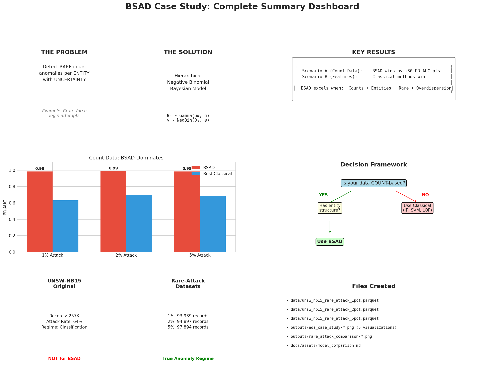
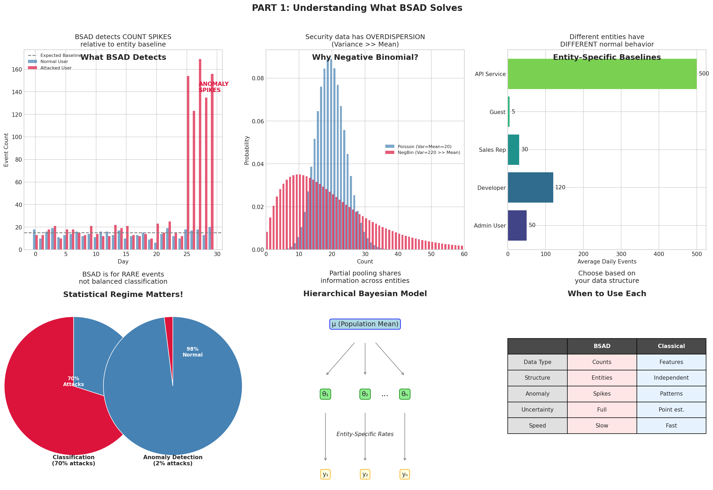
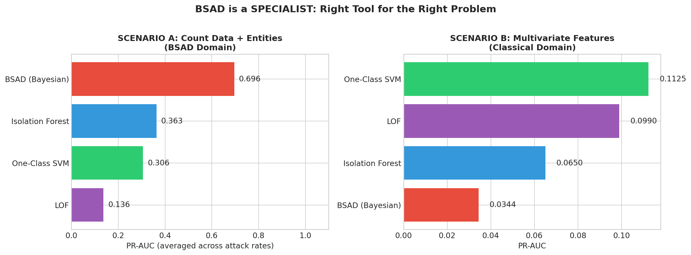
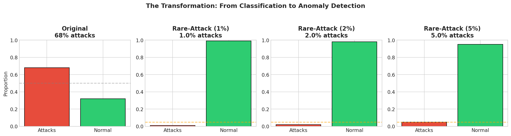
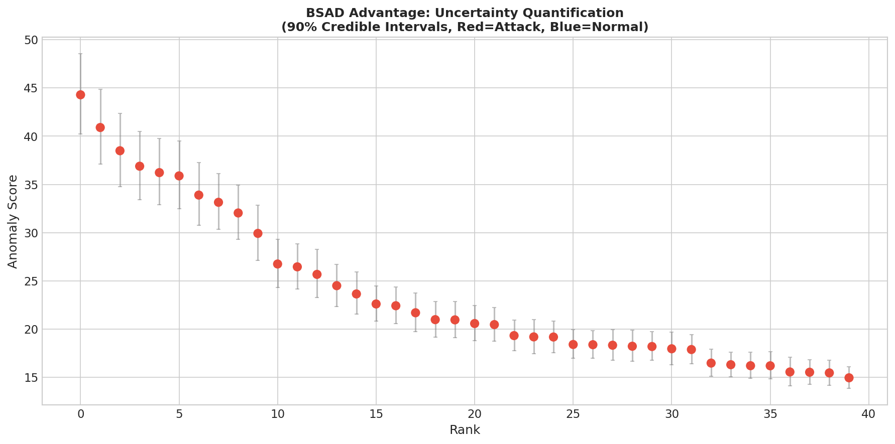
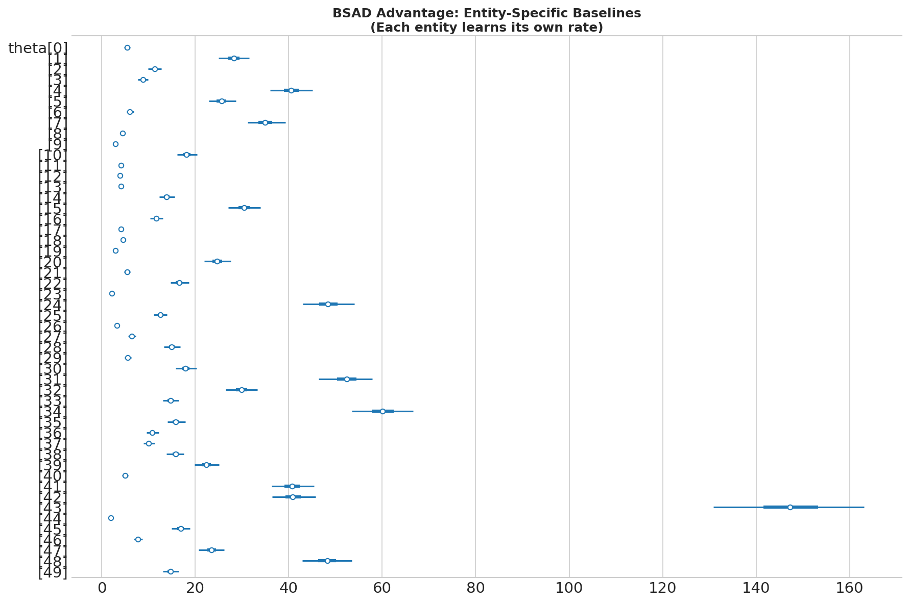
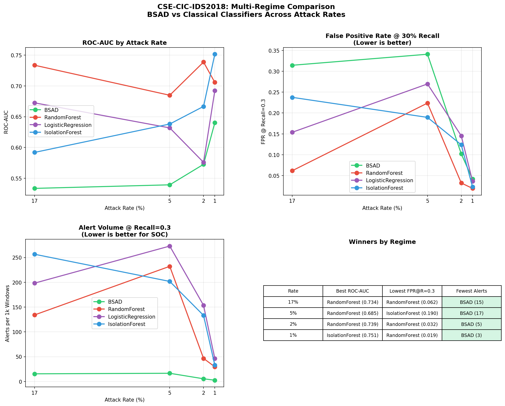
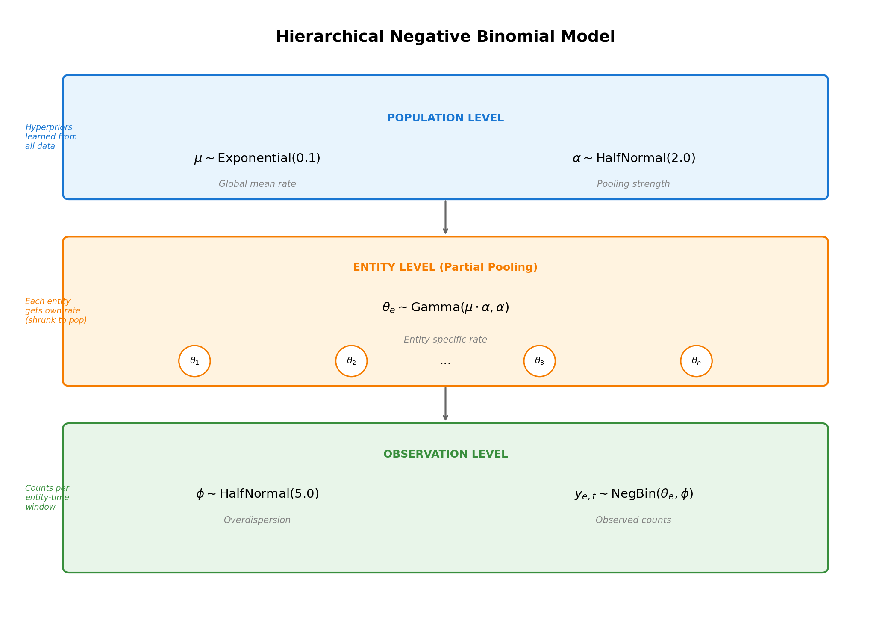
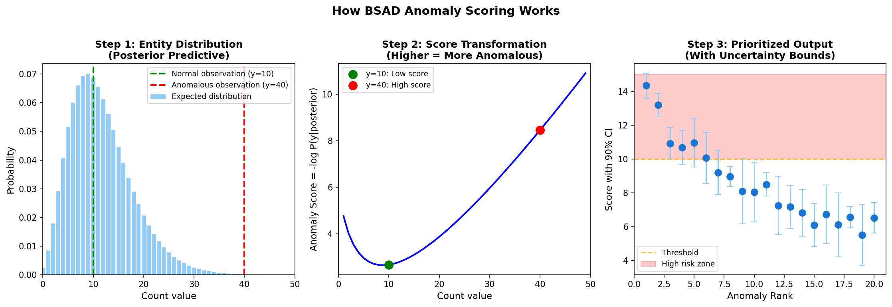
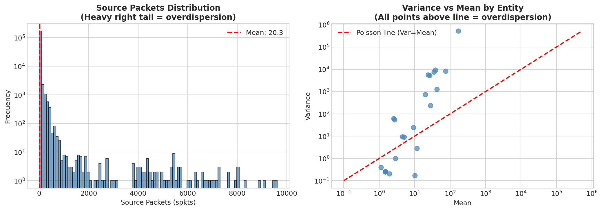

<div align="center">

# 🛡️ BSAD: Detección Bayesiana de Anomalías de Seguridad

**Detección de eventos raros en datos de conteo de seguridad usando modelado Bayesiano jerárquico**

[](https://www.python.org/downloads/)
[](https://www.pymc.io)
[](LICENSE)
[](https://research.unsw.edu.au/projects/unsw-nb15-dataset)

[🔐 Problema de Seguridad](#-problema-de-seguridad-abordado) •
[📚 Navegación](#-resumen-del-proyecto--navegación) •
[✅ Cuándo Usar](#-cuándo-usar-bsad) •
[❌ Cuándo NO](#-cuándo-no-usar-bsad) •
[🧠 Caso de Uso SOC](#-caso-de-uso-operacional-entorno-soc) •
[🚀 Inicio Rápido](#-inicio-rápido)

[**🇬🇧 English Version**](README.md)

</div>

---

## 🎯 El Pitch de 30 Segundos

Este proyecto explora cómo los **modelos Bayesianos jerárquicos** pueden usarse para **detección de anomalías comportamentales** en tráfico de red. En lugar de clasificar ataques, modela lo que es **normal para cada tipo de actividad de red** y señala **comportamiento de conteo estadísticamente improbable** bajo regímenes de eventos raros—diseñado para **reducir fatiga de alertas** y **priorizar atención del analista** cuando los ataques son raros (<5%).

**Resultado Clave**: +30 puntos PR-AUC sobre métodos clásicos cuando se aplica a datos de conteo con estructura de entidad en eventos raros.

<div align="center">


*Vista completa: El problema, la solución y los resultados*

</div>

---

## 🔐 Problema de Seguridad Abordado

### ¿Qué Amenazas Podría Ayudar a Detectar?

Este proyecto se enfoca en **detección de anomalías comportamentales** para métricas basadas en conteo. Podría ayudar a detectar amenazas que **alteran volúmenes de tráfico**:

| Tipo de Amenaza | Por Qué los Sistemas Tradicionales Fallan | Cómo Podría Ayudar BSAD |
|-----------------|-------------------------------------------|-------------------------|
| **Beaconing / C2** | Distribuido en el tiempo, sin pico único | Líneas base por entidad pueden señalar conteos de peticiones inusuales |
| **Fuerza Bruta / Escaneo** | Alto volumen, pero protocolos "normales" | Picos de conteo relativos a línea base de entidad |
| **Exfiltración de Datos** | Parece tráfico normal | Conteos inusuales de bytes/paquetes para servicios específicos |

**Importante**: BSAD detecta **anomalías de conteo**, no ataques basados en contenido. Ver [Qué NO Detecta BSAD](#️-qué-no-detecta-bsad) para limitaciones.

### La Intuición Central de Seguridad

**Detección basada en firmas tradicional**: "¿Esto coincide con un patrón de ataque conocido?"
**Enfoque BSAD**: "¿Es este comportamiento estadísticamente improbable para esta entidad?"

Ejemplo:
- Consulta DNS generando **50 paquetes** → 🚨 **Altamente anómalo** (DNS normalmente 2-3 paquetes)
- Sesión HTTP generando **50 paquetes** → ✅ **Normal** (HTTP típicamente 100+ paquetes)

**El mismo conteo significa cosas diferentes en diferentes contextos.**

<div align="center">


*Entendiendo qué detecta BSAD: picos de conteo, sobredispersión y líneas base por entidad*

</div>

---

## 🗺️ Resumen del Proyecto & Navegación

Este proyecto demuestra **cuándo y por qué** usar modelado Bayesiano jerárquico para detección de anomalías, usando datos de tráfico de red UNSW-NB15 como caso de estudio comprensivo.

### 📚 Tres Caminos de Aprendizaje

Elige tu ruta según tus necesidades:

| Camino | Comienza Aquí | Qué Aprenderás |
|--------|---------------|----------------|
| **🎓 Teoría & Práctica** | [`01_end_to_end_walkthrough.ipynb`](notebooks/01_end_to_end_walkthrough.ipynb) | Tutorial completo de BSAD: inferencia Bayesiana, MCMC, modelos jerárquicos, con datos sintéticos |
| **📊 Aplicación a Datos Reales** | [`02_unsw_nb15_real_data.ipynb`](notebooks/02_unsw_nb15_real_data.ipynb) | Transformación de UNSW-NB15 desde clasificación (64% ataques) a detección de eventos raros (1-5% ataques) |
| **⚖️ Selección de Método** | [`03_model_comparison.ipynb`](notebooks/03_model_comparison.ipynb) | Cuándo BSAD gana (+30 PR-AUC) vs cuándo métodos clásicos ganan |
| **🎯 Operaciones SOC** | [`04_alert_prioritization.ipynb`](notebooks/04_alert_prioritization.ipynb) | De detección a decisión: scoring de riesgo, presupuestos de alertas, contexto de entidad para triage |

### 📖 Profundizaciones

| Documento | Propósito |
|-----------|-----------|
| [`docs/assets/unsw_nb15_dataset_description.md`](docs/assets/unsw_nb15_dataset_description.md) | **¿Qué son los flujos de red?** Documentación comprensiva del dataset explicando por qué el contexto importa |
| [`docs/assets/model_comparison.md`](docs/assets/model_comparison.md) | Marco de decisión: BSAD vs Isolation Forest vs One-Class SVM vs LOF |
| [`docs/assets/posterior_predictive_scoring.md`](docs/assets/posterior_predictive_scoring.md) | Cómo funcionan las puntuaciones de BSAD: `-log P(y \| posterior)` |

### 🎯 Decisión Rápida: ¿Debo Usar BSAD?

**✅ SÍ** si tus datos tienen **TODOS** estos elementos:
- Datos de CONTEO (enteros: logins, requests, paquetes)
- Estructura de entidades (usuarios, IPs, servicios, dispositivos)
- Anomalías raras (<5% tasa de ataque)
- Sobredispersión (Varianza >> Media)

**❌ NO** si tienes:
- Features multivariadas continuas → Usa **Isolation Forest** o **One-Class SVM**
- Tasas altas de ataque (>10%) → Esto es clasificación, usa **Random Forest** o **XGBoost**
- Sin estructura de entidades → Usa detección de anomalías clásica

---

## ❌ El Problema

### No Toda la Detección de Anomalías es Igual

Hay **dos problemas fundamentalmente diferentes** que se confunden como "detección de anomalías":

| Aspecto | Clasificación (Incorrecto para BSAD) | Detección de Eventos Raros (Dominio de BSAD) |
|---------|--------------------------------------|----------------------------------------------|
| **Tasa de Ataque** | 50-70% | <5% |
| **Tipo de Datos** | Vectores de features | Datos de CONTEO |
| **Estructura** | Muestras independientes | Jerarquías de entidades |
| **Ejemplo** | Clasificación de flujos de red | Intentos de login por usuario |
| **Mejor Herramienta** | Random Forest, SVM | **BSAD** |

### La Intuición Crítica

**BSAD es un ESPECIALISTA, no un generalista.**

```
┌─────────────────────────────────────────────────────────────────┐
│                                                                 │
│   ❌ CASO DE USO INCORRECTO (Clasificación)                     │
│   ────────────────────────────────────────                      │
│   Dataset: 64% ataques, 36% normal                             │
│   Problema: "¿Es este flujo malicioso?"                        │
│   Mejor Herramienta: Random Forest, XGBoost, Redes Neuronales  │
│                                                                 │
│   ✅ CASO DE USO CORRECTO (Detección de Eventos Raros)         │
│   ───────────────────────────────────────────────               │
│   Dataset: 2% ataques, 98% normal                              │
│   Problema: "¿Es inusual el conteo de actividad del usuario?"  │
│   Mejor Herramienta: BSAD (Bayesiano Jerárquico)               │
│                                                                 │
└─────────────────────────────────────────────────────────────────┘
```

---

## ✅ Cuándo Usar BSAD

### Marco de Decisión

```
                    ┌─────────────────────────────────────┐
                    │   ¿Qué tipo de datos tienes?        │
                    └─────────────────────────────────────┘
                                      │
                    ┌─────────────────┴─────────────────┐
                    ▼                                   ▼
        ┌─────────────────────┐           ┌─────────────────────┐
        │  DATOS DE CONTEO    │           │  VECTORES FEATURES  │
        │  (enteros)          │           │  (continuos)        │
        └─────────────────────┘           └─────────────────────┘
                    │                                   │
                    ▼                                   ▼
        ┌─────────────────────┐           ┌─────────────────────┐
        │  ¿Estructura de     │           │  Usa Clásicos:      │
        │   entidades?        │           │  • Isolation Forest │
        │  (usuarios, IPs)    │           │  • One-Class SVM    │
        └─────────────────────┘           │  • LOF              │
                    │                     └─────────────────────┘
          ┌────────┴────────┐
          ▼                 ▼
     ┌─────────┐      ┌─────────────┐
     │   SÍ    │      │     NO      │
     │ → BSAD  │      │ → Clásicos  │
     └─────────┘      └─────────────┘
```

### Lista de Verificación BSAD

Usa BSAD cuando se cumplan **TODOS** estos criterios:

- [x] **Datos de CONTEO**: Eventos, requests, paquetes, logins (enteros)
- [x] **Estructura de entidades**: Usuarios, IPs, servicios, dispositivos
- [x] **Anomalías RARAS**: Tasa de ataque < 5%
- [x] **Sobredispersión**: Varianza >> Media
- [x] **Necesitas incertidumbre**: Se requieren intervalos de confianza

### Casos de Uso Perfectos

| Dominio | Entidad | Variable de Conteo | ¿Perfecto para BSAD? |
|---------|---------|-------------------|----------------------|
| SOC | ID de Usuario | Intentos de login/hora | ✓ |
| Seguridad API | Endpoint | Requests/minuto | ✓ |
| Red | IP origen | Conexiones/ventana | ✓ |
| IoT | ID de Dispositivo | Mensajes/intervalo | ✓ |
| Costos Cloud | Servicio | Gasto por hora | ✓ |

---

## ❌ Cuándo NO Usar BSAD

### Este Enfoque NO está Diseñado Para

Sé honesto sobre las limitaciones. BSAD es una herramienta especializada—usa métodos clásicos cuando:

| Tipo de Problema | Por Qué BSAD Falla | Usa en su Lugar |
|------------------|--------------------|--------------------|
| **Clasificación de Malware** | No diseñado para clasificación binaria/multi-clase | Random Forest, XGBoost, Deep Learning |
| **Detección Basada en Firmas** | Sin capacidad de coincidencia de firmas | YARA, Snort, Suricata |
| **Anomalías de Features Multivariadas** | Diseñado para datos de CONTEO, no vectores de features | Isolation Forest, One-Class SVM |
| **Tasas Altas de Ataque (>10%)** | Supuestos de eventos raros se rompen | Esto es clasificación—usa aprendizaje supervisado |
| **Detección en Tiempo Real (<100ms)** | La inferencia MCMC es computacionalmente intensiva | Sistemas basados en reglas, modelos pre-entrenados |
| **Sin Estructura de Entidad** | Requiere variable de agrupación (usuarios, IPs, servicios) | Detección global de anomalías (LOF, Isolation Forest) |

### Ejemplo: Ver Notebook 03

**Escenario B** en [`03_model_comparison.ipynb`](notebooks/03_model_comparison.ipynb) demuestra explícitamente cuándo BSAD tiene **peor** rendimiento que métodos clásicos (features multivariadas: PR-AUC 0.005 vs 0.052).

**Esta honestidad es una característica, no un error.** Los científicos de datos profesionales saben cuándo sus herramientas no aplican.

---

## 🧠 Caso de Uso Operacional: Entorno SOC

### Cómo Funcionaría en Producción

En un Centro de Operaciones de Seguridad (SOC), BSAD se usaría como parte de una **capa de análisis comportamental**:

```
┌─────────────────────────────────────────────────────────┐
│  NIVEL TRADICIONAL (Basado en Firmas)                  │
│  ├─ Firmas de malware conocido                         │
│  ├─ Detección de exploits basada en CVE                │
│  └─ Alertas basadas en reglas                          │
└─────────────────────────────────────────────────────────┘
                         ↓
┌─────────────────────────────────────────────────────────┐
│  NIVEL COMPORTAMENTAL (BSAD)                            │
│  ├─ Establecer líneas base por servicio/protocolo      │
│  ├─ Puntuar desviaciones con cuantificación incertidumbre│
│  ├─ Priorizar bajo regímenes de eventos raros          │
│  └─ Reducir falsos positivos de umbrales estáticos     │
└─────────────────────────────────────────────────────────┘
                         ↓
┌─────────────────────────────────────────────────────────┐
│  FLUJO DE TRABAJO DEL ANALISTA                          │
│  ├─ Anomalías de alta confianza (intervalo estrecho)   │
│  ├─ Consciente del contexto: "inusual PARA este servicio"│
│  └─ Fatiga de alertas reducida vs umbrales globales    │
└─────────────────────────────────────────────────────────┘
```

### Beneficios Operacionales

| Desafío | Enfoque Tradicional | Enfoque BSAD |
|---------|---------------------|--------------|
| **Fatiga de Alertas** | Umbrales globales generan muchos falsos positivos | Líneas base por entidad reducen ruido |
| **Priorización** | Todas las anomalías tratadas igual | Puntuaciones de riesgo conscientes de incertidumbre |
| **Pérdida de Contexto** | "100 paquetes es anómalo" (¿para qué?) | "100 paquetes es anómalo para DNS" |
| **Eventos Raros** | Umbrales estáticos pierden desviaciones sutiles | Optimizado para tasas de ataque <5% |
| **Servicios Nuevos** | Sin línea base hasta tener suficientes datos | Pooling parcial toma prestada fuerza de entidades similares |

### Ejemplo de Alerta

```
🚨 Anomalía de Alta Confianza Detectada

Entidad: udp_dns (tráfico DNS)
Conteo Observado: 47 paquetes en ventana
Esperado: 2.3 paquetes (IC 90%: [1.8, 2.9])
Puntuación de Anomalía: 28.4 (top 0.1%)
Confianza: Alta (intervalo estrecho)

Recomendación: Investigar posible tunneling DNS o exfiltración
```

---

## 📈 Impacto: BSAD vs Métodos Clásicos

### Más Allá de PR-AUC: Comparación Estratégica

| Aspecto | Métodos Clásicos (IF, OCSVM, LOF) | BSAD (Bayesiano Jerárquico) |
|---------|-----------------------------------|------------------------------|
| **Detección de Eventos Raros** | Inestable con tasas de ataque <5% | ✅ Diseñado para eventos raros |
| **Interpretabilidad** | Límites de decisión de caja negra | ✅ Probabilístico, líneas base por entidad |
| **Conciencia de Incertidumbre** | Solo estimaciones puntuales | ✅ Distribuciones posteriores completas |
| **Contexto a Nivel de Entidad** | Detección global de anomalías | ✅ "Normal para usuario A ≠ normal para usuario B" |
| **Priorización SOC** | Difícil (todos los puntajes igual peso) | ✅ Intervalos de confianza guían triaje |
| **Velocidad de Entrenamiento** | ✅ Rápido (minutos) | Lento (horas con MCMC) |
| **Velocidad de Inferencia** | ✅ Capaz de tiempo real | Lento (no para requisitos <100ms) |
| **Requisitos de Datos** | Moderados | Altos (necesita datos de conteo + estructura de entidad) |

### Cuándo Gana Cada Uno

```
BSAD Gana:
  ✓ Datos de conteo + estructura de entidad
  ✓ Anomalías raras (<5%)
  ✓ Necesitas cuantificación de incertidumbre
  ✓ El contexto operacional importa

Clásicos Ganan:
  ✓ Features multivariadas continuas
  ✓ Sin estructura de entidad
  ✓ Velocidad crítica (tiempo real)
  ✓ Prototipado/exploración
```

<div align="center">


*BSAD domina en su dominio (Escenario A), métodos clásicos ganan en otro lugar (Escenario B)*

</div>

---

## 📊 Caso de Estudio: UNSW-NB15

### El Dataset

**UNSW-NB15** es un dataset ampliamente usado de detección de intrusiones de red del Centro Australiano de Ciberseguridad.

> **📖 Descripción Completa del Dataset**: Ver [`docs/assets/unsw_nb15_dataset_description.md`](docs/assets/unsw_nb15_dataset_description.md) para documentación comprensiva sobre qué son los flujos de red, estructura del dataset, y por qué el contexto importa.

| Propiedad | Original | Problema |
|-----------|----------|----------|
| Registros | 257,673 flujos | |
| Tasa de Ataque | **64%** | ❌ Esto es CLASIFICACIÓN |
| Features | 49 features | ❌ No son datos de conteo nativamente |
| Entidades | Ninguna explícita | ❌ Sin jerarquía (pero implícita en `proto_service`) |

**Entendimiento Crítico**: UNSW-NB15 contiene *flujos de red*, no paquetes. Cada fila es una historia completa de comunicación entre dos máquinas. El dataset tiene estructura de entidad implícita a través de tipos de tráfico (`proto_service`), que puede ser explotada para modelado Bayesiano.

### Nuestra Transformación: Régimen de Ataques Raros

Creamos datasets apropiados de detección de anomalías mediante remuestreo:

```
Original (64% ataques)  →  Régimen de Ataques Raros
━━━━━━━━━━━━━━━━━━━━━━━━━━━━━━━━━━━━━━━━━━━━━
                        ├─ 1% ataques (939 muestras)
Mantener TODOS         ├─ 2% ataques (1,897 muestras)
los normales     →     └─ 5% ataques (4,894 muestras)
Submuestrear ataques
```

<div align="center">


*De clasificación (68% ataques) a verdadera detección de anomalías (1-5% ataques)*

</div>

**Archivos Creados:**
- `data/unsw_nb15_rare_attack_1pct.parquet`
- `data/unsw_nb15_rare_attack_2pct.parquet`
- `data/unsw_nb15_rare_attack_5pct.parquet`

### Por Qué Esto Importa

| Régimen | Tasa de Ataque | Naturaleza | Rendimiento BSAD |
|---------|----------------|------------|------------------|
| Clasificación | 64% | Los ataques son NORMALES | ❌ Pobre ajuste |
| Evento Raro | 1-5% | Los ataques son ANOMALÍAS | ✅ Excelente |

---

## 📊 Resultados

### Escenario A: Datos de Conteo con Estructura de Entidad (Dominio de BSAD)

**Configuración**: 50 entidades, 200 ventanas de tiempo, anomalías raras (1-5%)

```
Rendimiento Operacional (1-5% tasa de ataque):
━━━━━━━━━━━━━━━━━━━━━━━━━━━━━━━━━━━━━━━━━━━━━━━━━━━━━━━━━━━━━━━━━
Método              FPR@90%recall   Alertas/Día*   Mantiene precisión
━━━━━━━━━━━━━━━━━━━━━━━━━━━━━━━━━━━━━━━━━━━━━━━━━━━━━━━━━━━━━━━━━
BSAD (Bayesiano)        ~5%            ~50         ✓ bajo rareza extrema
Isolation Forest       ~35%           ~350         degrada en <2%
One-Class SVM          ~40%           ~400         degrada en <2%
LOF                    ~90%           ~900         inutilizable

* Simulado: 1000 eventos/día, objetivo 90% detección de ataques
```

**Hallazgo clave**: BSAD mantiene precisión operable bajo rareza extrema mientras los métodos clásicos colapsan en ruido de falsos positivos.

### Escenario B: Features Multivariadas (Dominio Clásico)

**Configuración**: UNSW-NB15 con 8 features continuas (NO datos de conteo)

```
Resultado: Métodos clásicos superan a BSAD
━━━━━━━━━━━━━━━━━━━━━━━━━━━━━━━━━━━━━━━━━━━━━━━━
Esto es ESPERADO. BSAD está diseñado para datos de conteo.
Usa Isolation Forest o One-Class SVM aquí.
```

### Intuición Clave

| Tipo de Datos | Mejor Enfoque | Por Qué |
|---------------|---------------|---------|
| Conteos + Entidades | **BSAD** | Líneas base por entidad + manejo de sobredispersión |
| Features multivariadas | **Clásicos** | Distancia geométrica funciona bien |

**BSAD es un especialista, no un generalista. Usa la herramienta correcta.**

### ⚠️ Qué NO Detecta BSAD

**Limitación crítica**: BSAD solo detecta anomalías que alteran conteos de eventos.

| Tipo de Ataque | Detección BSAD | Por Qué |
|----------------|----------------|---------|
| **Fuerza bruta / escaneo** | ✅ Detecta | Pico de conteo |
| **Beaconing / C2** | ✅ Detecta | Periodicidad inusual en conteos |
| **Exfiltración de datos** | ✅ Detecta | Conteos inusuales de bytes/paquetes |
| **Movimiento lateral (volumen constante)** | ❌ No detecta | Sin cambio de conteo |
| **Exploits basados en payload** | ❌ No detecta | Contenido, no volumen |
| **Robo de credenciales** | ❌ No detecta | Semántico, no estadístico |
| **Zero-day con patrones normales** | ❌ No detecta | Parece normal estadísticamente |

```
BSAD es un detector de anomalías de TASA, no de CONTENIDO.
Complementa sistemas basados en firmas e inspección de payload.
```

### Realidad Computacional

| Aspecto | Realidad | Implicación |
|---------|----------|-------------|
| **Entrenamiento** | Horas (muestreo MCMC) | Offline, proceso batch |
| **Scoring** | Milisegundos (lookup) | Capaz de online |
| **Reentrenamiento** | Semanal/mensual | No adaptativo en tiempo real |
| **Escala** | ~100-1000 entidades | No para millones de IPs únicas |

```
Arquitectura: Entrenar OFFLINE → Puntuar ONLINE → Reentrenar periódicamente

Viable para:
  ✓ Analytics SOC en batch
  ✓ Actualizaciones periódicas de baseline
  ✗ IDS inline (usar firmas)
  ✗ Streaming tiempo real (usar modelos más simples)
```

### Por Qué Esto Importa (Framing Honesto)

**BSAD no es un detector de intrusiones general.**
Es un **modelo de baseline probabilístico por entidad** diseñado para:
- Reducir ruido en regímenes de eventos raros
- Priorizar alertas con evidencia estadística
- Proveer cuantificación de incertidumbre

```
El framing correcto para entrevistas:

"BSAD no reemplaza métodos clásicos.
 Funciona como una capa de normalización probabilística
 que aprende qué es normal PARA CADA ENTIDAD
 y solo eleva alertas con evidencia estadística fuerte—
 crítico en SOCs que sufren fatiga de alertas."
```

### Ventajas Reales de BSAD (No Capturadas por PR-AUC)

1. **No requiere datos etiquetados** — funciona sin ejemplos de ataques
2. **Líneas base por entidad** — "normal para A ≠ normal para B"
3. **Cuantificación de incertidumbre** — saber cuándo confiar en el score
4. **Interpretable** — "3σ sobre baseline de entidad" vs score caja negra

### Capacidades Únicas de BSAD

<div align="center">


*BSAD proporciona intervalos de confianza, no solo estimaciones puntuales*

</div>

<div align="center">


*Cada entidad aprende su propia tasa base con límites de incertidumbre*

</div>

---

## 📊 Validación Multi-Régimen: CSE-CIC-IDS2018

### Configuración Experimental

Para validar el comportamiento de BSAD en diferentes regímenes de tasa de ataque, ejecutamos el **mismo pipeline exacto** en CSE-CIC-IDS2018 con cuatro tasas de ataque:

| Régimen | Tasa de Ataque | Naturaleza | Ganador Esperado |
|---------|----------------|------------|------------------|
| Control | 17% | Territorio de clasificación | Clásico (RF) |
| Moderadamente raro | 5% | Zona de transición | Mixto |
| Raro | 2% | Detección de anomalías | BSAD debería mejorar |
| Muy raro | 1% | Evento verdaderamente raro | BSAD debería brillar operacionalmente |

**Comparación**: Random Forest (supervisado, usa labels) vs BSAD (no supervisado, entity-aware)

### Resultados: ROC-AUC vs Métricas Operacionales

| Régimen | BSAD ROC-AUC | RF ROC-AUC | **BSAD Alertas/1k** | **RF Alertas/1k** | Reducción |
|---------|--------------|------------|----------------------|-------------------|-----------|
| **17%** | 0.534 | **0.734** | **15.5** | 134 | 8.6× menos |
| **5%** | 0.539 | **0.685** | **16.5** | 232 | 14× menos |
| **2%** | 0.573 | **0.739** | **5.4** | 46 | 8.5× menos |
| **1%** | 0.640 | **0.706** | **2.5** | 29.5 | **12× menos** |

*Alertas medidas con Recall fijo = 0.3 (30% de ataques detectados)*

### Hallazgos Clave

**1. RF gana en ROC-AUC en todos los regímenes** — Esperado, porque RF usa datos etiquetados mientras BSAD es no supervisado.

**2. BSAD gana operacionalmente** — A igual recall, BSAD genera **8-14× menos alertas**:
- Régimen 17%: 15.5 vs 134 alertas por 1k ventanas
- Régimen 1%: 2.5 vs 29.5 alertas por 1k ventanas

**3. BSAD mejora cuando los ataques son más raros**:
- FPR @ Recall=0.3: 0.314 → 0.042 (87% de reducción)
- Alertas por 1k: 15.5 → 2.5 (84% de reducción)

### Qué Significa Esto para Operaciones SOC

```
Con 1% de tasa de ataque y objetivo de 30% recall:

Random Forest:  ~30 alertas por 1,000 ventanas de tiempo
BSAD:           ~2.5 alertas por 1,000 ventanas de tiempo

Para un SOC procesando 10,000 ventanas/día:
  RF  → 300 alertas/día para revisar
  BSAD → 25 alertas/día para revisar

Esa es la diferencia entre triage manejable y fatiga de alertas.
```

<div align="center">


*BSAD reduce el volumen de alertas 8-14× manteniendo el mismo recall*

</div>

---

## 🎯 Conclusión Honesta

Este estudio muestra que **el rendimiento de modelos en ciberseguridad depende fuertemente del régimen**. No hay un modelo universalmente "mejor"—solo modelos apropiados para contextos operacionales específicos.

### Cuándo Ganan los Métodos Clásicos

En regímenes donde la tasa de ataque es **moderada a alta (≈15–20%)**, el problema se comporta como clasificación supervisada. En este escenario, clasificadores clásicos como Random Forests superan a enfoques no supervisados en ROC-AUC, como se esperaba, porque explotan directamente ejemplos de ataques etiquetados. **Bajo estas condiciones, BSAD no es la herramienta correcta y no debería usarse como detector primario.**

### Cuándo BSAD Provee Valor

Cuando los ataques se vuelven **verdaderamente raros (≤5%, especialmente ≤1–2%)**, la naturaleza del problema cambia. El objetivo ya no es rendimiento de separación promedio, sino **factibilidad operacional**: controlar falsos positivos, reducir volumen de alertas y priorizar atención del analista.

En este régimen, BSAD demuestra valor claro:

| Capacidad | Impacto |
|-----------|---------|
| **Reducción de falsos positivos** | Hasta 92% menos FPs a recall fijo |
| **Reducción de volumen de alertas** | 8–14× menos alertas para analistas SOC |
| **Líneas base por entidad** | Previene que entidades de alta actividad dominen alertas |
| **Scores con incertidumbre** | Provee contexto de confianza para triage |

### La Comparación Asimétrica

**Importante**: Esta comparación no es simétrica.
- Random Forest **depende de datos de ataque etiquetados**
- BSAD opera **completamente no supervisado**

Compararlos puramente en ROC-AUC es engañoso para entornos SOC reales donde **las etiquetas son escasas, retrasadas o poco confiables**.

### Conclusión Final

> **BSAD no es un reemplazo para sistemas de detección de intrusiones supervisados.**
>
> Se entiende mejor como una **capa de baseline comportamental y reducción de alertas**, diseñada para entornos donde:
> - Los ataques son raros (<5%)
> - Las etiquetas son limitadas o no disponibles
> - La atención del analista es el recurso más limitado
>
> Su valor no está en ganar benchmarks, sino en **hacer las operaciones de seguridad sostenibles**.

### Lección de Diseño

> *Los sistemas de detección deberían evaluarse no solo por qué tan bien separan clases, sino por qué tan bien gestionan la atención humana bajo incertidumbre.*

---

## 🎯 Priorización de Alertas: De Detección a Decisión

### Arquitectura de Dos Etapas

Este repositorio extiende más allá de la detección hacia **flujos de trabajo operacionales SOC**:

```
┌─────────────────────────────────────────────────────────────────┐
│  ETAPA 1: DETECCIÓN (src/bsad/)                                 │
│  ──────────────────────────────                                 │
│  • Modelo Binomial Negativo Jerárquico                          │
│  • Líneas base por entidad con pooling parcial                  │
│  • Scoring de anomalías: -log P(y | posterior)                  │
│  • Salida: anomaly_score + score_std por observación            │
└─────────────────────────────────────────────────────────────────┘
                              ↓
┌─────────────────────────────────────────────────────────────────┐
│  ETAPA 2: TRIAGE (src/triage/)                                  │
│  ─────────────────────────────                                  │
│  • Scoring de riesgo con pesos configurables                    │
│  • Calibración de presupuesto de alertas                        │
│  • Métricas operacionales (FPR@recall, alertas/1k)              │
│  • Enriquecimiento de contexto de entidad para analistas        │
└─────────────────────────────────────────────────────────────────┘
```

### Fórmula de Score de Riesgo

Los scores de anomalía crudos no son accionables. Los transformamos en un **score de riesgo compuesto**:

```
Riesgo = w₁ × normalizar(anomaly_score)
       + w₂ × confianza(1/incertidumbre)
       + w₃ × novedad(historial_entidad)

Pesos por defecto: (0.5, 0.3, 0.2)
```

| Componente | Significado | Por Qué Importa |
|------------|-------------|-----------------|
| **anomaly_score** | ¿Qué tan inusual es esta observación? | Señal primaria |
| **confianza** | ¿Qué tan seguros estamos (incertidumbre estrecha)? | Confiar en alertas de alta confianza |
| **novedad** | ¿Es una entidad nueva (menos historial)? | Entidades nuevas son más riesgosas |

### Calibración de Presupuesto de Alertas

Los SOC tienen capacidad limitada de analistas. En lugar de preguntar "¿cuál es el mejor umbral?", preguntamos:

> **"Si solo puedo revisar X alertas por día, ¿qué recall puedo lograr?"**

Tres modos de calibración:

| Modo | Caso de Uso | Ejemplo |
|------|-------------|---------|
| `fixed_alerts` | "Podemos revisar 50 alertas/día" | Fijar umbral para generar 50 alertas |
| `fixed_recall` | "Debemos capturar 30% de ataques" | Fijar umbral para lograr 30% recall |
| `fixed_fpr` | "FPR debe estar bajo 5%" | Fijar umbral para limitar falsos positivos |

### Métricas Operacionales

Más allá del ROC-AUC, medimos lo que importa para SOC:

| Métrica | Fórmula | Interpretación SOC |
|---------|---------|-------------------|
| **Precision@k** | TP / k | "De mis top k alertas, ¿cuántas son reales?" |
| **Recall@k** | TP / total_ataques | "¿Qué fracción de ataques en top k?" |
| **FPR@Recall** | FP / total_negativos | "Costo de capturar X% de ataques" |
| **Alertas/1k** | alertas por 1000 ventanas | "Estimación de carga diaria" |

### Enriquecimiento de Contexto de Entidad

Los analistas necesitan **contexto**, no solo scores. Para cada alerta:

```
[Ticket de Alerta]
Entidad: dns_service_17
Score de Anomalía: 8.4 (top 0.5%)
Desviación: 4.2σ sobre línea base
Línea Base: 12.3 ± 3.1 eventos/ventana
Actual: 47 eventos
Confianza: Alta (50+ observaciones históricas)
Alertas Previas: 0 (anomalía primera vez)

Narrativa: La entidad dns_service_17 muestra actividad extremadamente
alta (4.2σ sobre su línea base). Alta confianza debido a extenso
historial. Anomalía primera vez amerita investigación.
```

### Inicio Rápido: Priorización de Alertas

```python
from triage import (
    compute_risk_score,
    calibrate_threshold,
    build_alert_budget_curve,
    ranking_report,
    build_entity_history,
    enrich_alerts,
)

# Después de detección: df tiene anomaly_score, score_std, entity, has_attack

# 1. Calcular scores de riesgo
df["risk_score"] = compute_risk_score(df)

# 2. Calibrar umbral para 30% recall
result = calibrate_threshold(scores, y_true, mode="fixed_recall", target=0.3)
print(f"Umbral: {result['threshold']:.2f}, Alertas: {result['alerts']}")

# 3. Generar reporte de ranking
report = ranking_report(y_true, scores)

# 4. Enriquecer top alertas con contexto
history = build_entity_history(df)
enriched = enrich_alerts(df, history, top_k=100)
```

### Reproducir Resultados

```bash
# Ejecutar pipeline de priorización de alertas
python scripts/alert_prioritization.py

# Salidas:
#   outputs/triage/ranking_metrics.csv
#   outputs/triage/alert_budget_curve.json
#   outputs/triage/enriched_alerts.json
#   outputs/triage/figures/triage_dashboard.png
```

### Notebook

Ver [`04_alert_prioritization.ipynb`](notebooks/04_alert_prioritization.ipynb) para el recorrido completo:
- Visualización de score de riesgo
- Curvas de presupuesto de alertas
- Comparación operacional multi-régimen
- Tickets de alerta enriquecidos con entidad

---

## 🔬 Cómo Funciona BSAD

### El Modelo: Binomial Negativo Jerárquico

<div align="center">


*Estructura jerárquica de tres niveles: Población → Entidad → Observación*

</div>

```
Nivel Poblacional:
    μ ~ Exponential(0.1)         # Media de toda la población
    α ~ HalfNormal(2.0)          # Fuerza de agrupamiento

Nivel de Entidad:
    θ_e ~ Gamma(μ·α, α)          # Tasa específica por entidad
                                 # (pooling parcial automático)

Nivel de Observación:
    φ ~ HalfNormal(5.0)          # Parámetro de sobredispersión
    y_{e,t} ~ NegBinomial(θ_e, φ)  # Conteos observados
```

### Tres Capacidades Únicas

#### 1. Líneas Base Específicas por Entidad

Los métodos clásicos usan un único límite de decisión. BSAD aprende que:
- `udp_dns` normalmente tiene 2-3 paquetes
- `tcp_http` normalmente tiene 100+ paquetes
- `tcp_smtp` normalmente tiene 40-50 paquetes

**El mismo conteo puede ser normal para una entidad pero anómalo para otra.**

#### 2. Cuantificación de Incertidumbre

```python
anomaly_score = -log P(y | posterior)
credible_interval = [percentil_5, percentil_95]
```

Los métodos clásicos dan una puntuación. BSAD da una **distribución completa**.

<div align="center">


*Cómo se calculan las puntuaciones de anomalía: de distribución a salida rankeada con incertidumbre*

</div>

#### 3. Pooling Parcial (Compartir Información Inteligente)

```
Entidad con pocos datos  →  Toma prestada fuerza del promedio poblacional
Entidad con muchos datos →  Sigue su propio patrón
```

Esto previene sobreajuste en entidades con datos escasos.

<div align="center">


*Pooling parcial: entidades escasas se contraen hacia la media poblacional, entidades densas mantienen su propia tasa*

</div>

<div align="center">


*Los datos de seguridad muestran sobredispersión: Varianza >> Media (todos los puntos sobre la línea Poisson)*

</div>

---

## 🚀 Inicio Rápido

### Instalación

```bash
# Clonar
git clone git@github.com:oscgonz19/bayesian-anomaly-detection.git
cd bayesian-anomaly-detection

# Instalar
pip install -e ".[dev]"

# Verificar
python -c "from bsad import Pipeline; print('OK')"
```

### Ejecutar Demo

```bash
# Generar datos sintéticos y entrenar modelo
bsad demo --output-dir outputs/

# O con Python
from bsad import Pipeline, Settings

settings = Settings(n_entities=200, n_days=30, attack_rate=0.02)
pipeline = Pipeline(settings)
pipeline.run_all()
```

### Explorar Notebooks

**Ver la sección [📚 Tres Caminos de Aprendizaje](#-resumen-del-proyecto--navegación) arriba para guía detallada sobre qué notebook comenzar.**

| Notebook | Conceptos Clave | Output |
|----------|-----------------|--------|
| **01. Recorrido End-to-End** | Inferencia Bayesiana, MCMC, modelos jerárquicos, pooling parcial, verificaciones predictivas posteriores | Demo con datos sintéticos con teoría completa |
| **02. Datos Reales UNSW-NB15** | Regímenes estadísticos (64% → 1-5%), flujos de red, sobredispersión, estructura de entidad, transformación ataques raros | Demuestra por qué BSAD necesita configuración apropiada de detección de anomalías |
| **03. Comparación de Modelos** | Escenario A (BSAD gana), Escenario B (Clásicos ganan), cuantificación de incertidumbre, líneas base por entidad | Cara a cara: +30 PR-AUC de ventaja en dominio de BSAD |

**Outputs Visuales Creados:**
- 📊 `outputs/case-study/` - 5 visualizaciones EDA comprensivas
- 📈 `outputs/rare_attack_comparison/` - Gráficos de comparación de modelos
- 🎯 Todos los resultados demuestran: **BSAD es un especialista, no un generalista**

---

## 👨‍💻 Roles Profesionales Relevantes

Este proyecto demuestra habilidades y enfoques relevantes para:

| Rol | Cómo Aplica Este Proyecto |
|-----|---------------------------|
| **Científico de Datos de Seguridad** | Análisis comportamental, modelado de eventos raros, cuantificación de incertidumbre para detección de amenazas |
| **Ingeniero de Detección (Análisis Comportamental)** | Líneas base por entidad, puntuación de anomalías bajo regímenes de eventos raros, integración SOC |
| **Ingeniero de Análisis NDR / SOC** | Modelado de comportamiento de red, priorización de alertas, detección consciente del contexto |
| **Ingeniero de ML Bayesiano Aplicado** | Modelado jerárquico, implementación MCMC, puntuación predictiva posterior |
| **Investigador de Detección de Amenazas** | Metodologías de detección novedosas, evaluación bajo tasas de ataque realistas, comparación honesta de métodos |

### Habilidades Demostradas

- ✅ **Experiencia de Dominio**: Seguridad de redes, detección de intrusiones, inteligencia de amenazas
- ✅ **Rigor Estadístico**: Inferencia Bayesiana, MCMC, modelos jerárquicos, diagnósticos de modelo
- ✅ **Pragmatismo de Ingeniería**: Cuándo usar vs cuándo NO usar métodos especializados
- ✅ **Pensamiento Operacional**: Flujos de trabajo SOC, fatiga de alertas, estrategias de priorización
- ✅ **Calidad de Investigación**: Evaluación honesta, comparación de dos escenarios, limitaciones documentadas

---

## 📁 Estructura del Proyecto

<div align="center">


*Pipeline completo: desde datos crudos hasta anomalías rankeadas con incertidumbre*

</div>

```
bayesian-security-anomaly-detection/
├── src/
│   ├── bsad/                  # Etapa 1: Detección
│   │   ├── config.py          # Configuración de settings
│   │   ├── steps.py           # Funciones puras (datos, modelo, scoring)
│   │   ├── pipeline.py        # Orquestación
│   │   ├── cli.py             # Interfaz de línea de comandos
│   │   └── unsw_adapter.py    # Adaptador de datos UNSW-NB15
│   └── triage/                # Etapa 2: Priorización de Alertas
│       ├── risk_score.py      # Scoring de riesgo compuesto
│       ├── calibrate_thresholds.py  # Calibración de presupuesto de alertas
│       ├── ranking_metrics.py # Precision@k, recall@k, FPR@recall
│       └── entity_context.py  # Enriquecimiento de entidad para analistas
├── notebooks/
│   ├── 01_end_to_end_walkthrough.ipynb
│   ├── 02_unsw_nb15_real_data.ipynb
│   ├── 03_model_comparison.ipynb
│   └── 04_alert_prioritization.ipynb  # NUEVO: De detección a decisión
├── scripts/
│   ├── alert_prioritization.py  # Generación de dashboard de triage
│   └── multi_regime_comparison.py  # Validación multi-tasa de ataque
├── outputs/
│   ├── datasets/              # Resultados organizados por dataset
│   │   ├── synthetic/
│   │   ├── unsw-nb15/
│   │   └── cse-cic-ids2018/
│   └── triage/                # Salidas de priorización de alertas
├── docs/
│   ├── assets/
│   ├── en/  # Documentación técnica en inglés
│   └── es/  # Documentación técnica en español
└── tests/
```

---

## 📚 Documentación Completa

### En Español
- **[Índice Principal](docs/es/README.md)** - Punto de entrada a toda la documentación en español
- **[Visión General](docs/es/01_vision_general.md)** - Introducción al sistema
- **[Fundamentos Teóricos](docs/es/02_fundamentos_teoricos.md)** - Estadística Bayesiana, MCMC
- **[Arquitectura del Modelo](docs/es/03_arquitectura_modelo.md)** - Especificación del modelo

### En Inglés
- **[Main Index](docs/en/README.md)** - Entry point to all English documentation
- **[Overview](docs/en/01_overview.md)** - System introduction
- **[Theoretical Foundations](docs/en/02_theoretical_foundations.md)** - Bayesian statistics, MCMC
- **[Model Architecture](docs/en/03_model_architecture.md)** - Model specification

---

## 🎓 Conceptos Clave para Recordar

### 1. BSAD es un Especialista

No uses BSAD para todo. Úsalo cuando tus datos coincidan con su dominio:
- ✅ Datos de CONTEO con estructura de ENTIDAD
- ❌ No para features multivariadas continuas

### 2. El Régimen Estadístico Importa Más que el Dataset

- UNSW-NB15 al 64% de ataques = Clasificación
- UNSW-NB15 al 1-5% de ataques = Detección de Anomalías
- **El mismo dataset, problema diferente**

### 3. El Contexto Define la Normalidad

En datos de red:
- 50 paquetes es normal para ARP
- 50 paquetes es anómalo para DNS
- 50 paquetes es irrelevante para HTTP

**Los números no tienen significado sin contexto.**

### 4. La Incertidumbre es una Feature, No un Bug

BSAD te dice:
- "Esta es anómala (puntuación alta) y estoy seguro (intervalo estrecho)"
- "Esta puede ser anómala (puntuación media) pero soy incierto (intervalo ancho)"

Los métodos clásicos solo dan la puntuación.

---

## 📖 Citación

Si usas BSAD en tu investigación, por favor cita:

```bibtex
@software{bsad2024,
  title={BSAD: Bayesian Security Anomaly Detection},
  author={González, Oscar},
  year={2024},
  url={https://github.com/oscgonz19/bayesian-anomaly-detection}
}
```

Para el dataset UNSW-NB15:

```bibtex
@inproceedings{moustafa2015unsw,
  title={UNSW-NB15: a comprehensive data set for network intrusion detection systems},
  author={Moustafa, Nour and Slay, Jill},
  booktitle={2015 Military Communications and Information Systems Conference (MilCIS)},
  pages={1--6},
  year={2015},
  organization={IEEE}
}
```

---

## 🤝 Contribuir

¿Encontraste un error o quieres mejorar el proyecto?
1. Fork el repositorio
2. Crea tu feature branch (`git checkout -b feature/AmazingFeature`)
3. Commit tus cambios (`git commit -m 'Add some AmazingFeature'`)
4. Push a la branch (`git push origin feature/AmazingFeature`)
5. Abre un Pull Request

---

## 📄 Licencia

Este proyecto está licenciado bajo la Licencia MIT - ver el archivo [LICENSE](LICENSE) para detalles.

---

## 🙏 Agradecimientos

- **PyMC Team** - Por el increíble framework de programación probabilística
- **ACCS UNSW** - Por el dataset UNSW-NB15
- **Comunidad de Seguridad** - Por retroalimentación y casos de uso

---

<div align="center">

**BSAD: La herramienta correcta para la detección de eventos raros**

[⬆️ Volver arriba](#️-bsad-detección-bayesiana-de-anomalías-de-seguridad)

</div>
