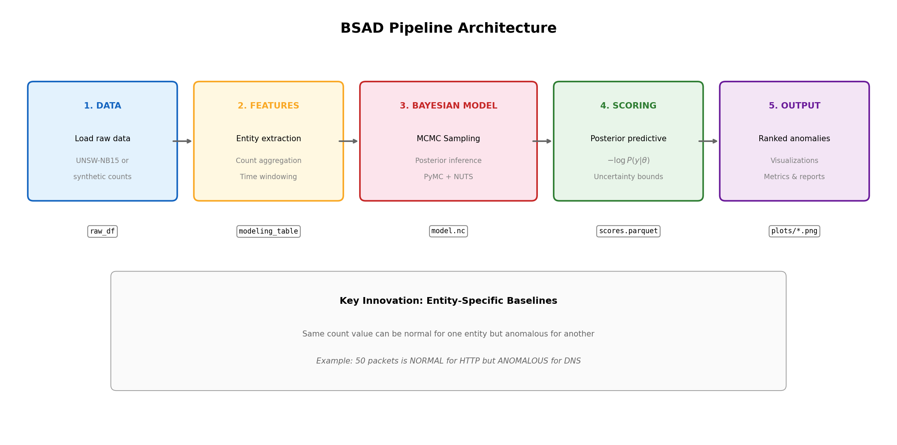

# Detección Bayesiana de Anomalías de Seguridad - Visión General

## Tabla de Contenidos
1. [Introducción](#introducción)
2. [Planteamiento del Problema](#planteamiento-del-problema)
3. [¿Por Qué Métodos Bayesianos?](#por-qué-métodos-bayesianos)
4. [Arquitectura del Sistema](#arquitectura-del-sistema)
5. [Componentes Principales](#componentes-principales)

---

## Introducción

**Detección Bayesiana de Anomalías de Seguridad (BSAD)** es un sistema de aprendizaje automático probabilístico diseñado para identificar patrones anómalos en registros de eventos de seguridad. A diferencia de los enfoques tradicionales basados en reglas o umbrales, BSAD aprovecha la inferencia Bayesiana para:

1. **Cuantificar la incertidumbre** en las predicciones de anomalías
2. **Compartir información** entre entidades mediante modelado jerárquico
3. **Adaptarse** a líneas base de comportamiento específicas de cada entidad
4. **Proporcionar puntuaciones interpretables** basadas en probabilidad

Esta documentación proporciona una guía completa para entender los fundamentos teóricos, detalles de implementación y uso práctico del sistema.

---

## Planteamiento del Problema

### El Desafío del Análisis de Logs de Seguridad

Los centros de operaciones de seguridad (SOC) modernos enfrentan un volumen abrumador de datos de eventos:

- **Escala**: Las organizaciones grandes generan millones de eventos de seguridad diariamente
- **Desbalance**: Los ataques reales representan una fracción mínima (<1%) de todos los eventos
- **Heterogeneidad**: Diferentes usuarios/sistemas tienen comportamientos "normales" muy distintos
- **Evolución**: Los patrones de ataque y el comportamiento normal cambian con el tiempo

### Enfoques Tradicionales y Sus Limitaciones

| Enfoque | Método | Limitaciones |
|---------|--------|--------------|
| **Basado en reglas** | Umbrales estáticos (ej: >100 logins/hora = alerta) | No se adapta a líneas base específicas por entidad; alto falsos positivos |
| **Estadístico** | Z-scores, bandas de desviación estándar | Asume distribuciones Gaussianas; no maneja heterogeneidad entre entidades |
| **Clasificación ML** | Modelos supervisados (Random Forest, etc.) | Requiere datos etiquetados; estimaciones puntuales sin incertidumbre |
| **Isolation Forest** | Detección de anomalías no supervisada | Sin interpretación probabilística; difícil de ajustar |

### Nuestro Enfoque: Modelado Bayesiano Jerárquico

BSAD aborda estas limitaciones mediante:

1. **Estructura jerárquica**: Aprende patrones a nivel poblacional mientras respeta la variación individual
2. **Verosimilitud Binomial Negativa**: Maneja datos de conteo sobredispersos comunes en logs de seguridad
3. **Inferencia posterior completa**: Proporciona estimaciones de incertidumbre, no solo predicciones puntuales
4. **Puntuación de anomalías con principios**: Basada en probabilidad predictiva posterior

---

## ¿Por Qué Métodos Bayesianos?

### Ventajas para Detección de Anomalías

#### 1. Cuantificación de Incertidumbre

El ML tradicional da estimaciones puntuales. La inferencia Bayesiana da distribuciones de probabilidad:

```
Tradicional: "Esta entidad tiene puntuación de anomalía 7.5"
Bayesiano:   "Esta entidad tiene puntuación de anomalía 7.5 (IC 90%: 5.2-9.8)"
```

Esta distinción importa operacionalmente:
- Alta puntuación con IC estrecho → Alta confianza, priorizar investigación
- Alta puntuación con IC amplio → Incierto, recopilar más datos antes de actuar

#### 2. Manejo de Datos Escasos

Los datos de seguridad son inherentemente escasos—muchas entidades tienen historial limitado. Los modelos jerárquicos Bayesianos manejan esto mediante **pooling parcial**:


*Pooling parcial: entidades escasas se contraen hacia la media poblacional, entidades densas mantienen su propia tasa*

- Entidades con **muchas observaciones**: Estimaciones impulsadas por sus propios datos
- Entidades con **pocas observaciones**: Estimaciones se "contraen" hacia la media poblacional

Esto previene tanto:
- Sobreajuste al ruido en muestras pequeñas
- Ignorar patrones específicos de entidad en muestras grandes

#### 3. Incorporación de Conocimiento Previo

Los métodos Bayesianos permiten incorporar conocimiento del dominio:

```python
# Sabemos que las tasas de eventos son positivas y típicamente moderadas
mu ~ Exponential(0.1)  # Prior: tasa media alrededor de 10 eventos/ventana
```

#### 4. Marco de Probabilidad Coherente

Todas las inferencias siguen la teoría de probabilidad. Las puntuaciones de anomalía tienen interpretación con principios:

```
puntuación_anomalía = -log p(y_observado | modelo)
```

Mayor puntuación = observación menos probable bajo el modelo aprendido = más anómalo.

### El Paradigma Bayesiano

En su núcleo, la inferencia Bayesiana sigue el teorema de Bayes:

```
p(θ|y) = p(y|θ) × p(θ) / p(y)

posterior ∝ verosimilitud × prior
```

Donde:
- **p(θ)** = Prior: Lo que creemos sobre los parámetros antes de ver datos
- **p(y|θ)** = Verosimilitud: Qué tan probable son nuestros datos dados los parámetros
- **p(θ|y)** = Posterior: Creencias actualizadas después de ver datos

---

## Arquitectura del Sistema

### Pipeline de Alto Nivel


*Pipeline completo: desde datos crudos hasta anomalías rankeadas con incertidumbre*

```
┌─────────────────┐     ┌─────────────────┐     ┌─────────────────┐
│  Logs de Eventos│────▶│  Ingeniería de  │────▶│ Modelo Bayesiano│
│   (sintéticos)  │     │ Características │     │  Entrenamiento  │
└─────────────────┘     └─────────────────┘     └─────────────────┘
                                                        │
                                                        ▼
┌─────────────────┐     ┌─────────────────┐     ┌─────────────────┐
│   Evaluación    │◀────│  Puntuación de  │◀────│    Muestras     │
│   y Reportes    │     │    Anomalías    │     │   Posteriores   │
└─────────────────┘     └─────────────────┘     └─────────────────┘
```

### Responsabilidades de Componentes

| Componente | Módulo | Responsabilidad |
|------------|--------|-----------------|
| Generación de Datos | `data_generator.py` | Crear logs de seguridad sintéticos con patrones de ataque conocidos |
| Ingeniería de Características | `features.py` | Agregar eventos en características por entidad-ventana |
| Definición del Modelo | `model.py` | Definir estructura del modelo Bayesiano jerárquico |
| Inferencia | `model.py` | Ajustar modelo usando MCMC (sampler NUTS) |
| Puntuación | `scoring.py` | Calcular puntuaciones de anomalía desde predictivo posterior |
| Evaluación | `evaluation.py` | Calcular métricas PR-AUC, Recall@K |
| Visualización | `visualization.py` | Generar gráficos de diagnóstico |
| Interfaz CLI | `cli.py` | Herramientas de línea de comandos para el usuario |

---

## Componentes Principales

### 1. Generador de Datos Sintéticos

Genera logs de eventos de seguridad realistas con cuatro patrones de ataque:

- **Fuerza Bruta**: Intentos de login de alta frecuencia desde una sola IP
- **Credential Stuffing**: Intentos moderados a través de muchos usuarios desde una sola IP
- **Anomalía Geográfica**: Acceso desde ubicaciones inusuales
- **Anomalía de Dispositivo**: Múltiples nuevas huellas de dispositivo

### 2. Ingeniería de Características

Transforma eventos crudos en características listas para modelado:

- Agregación por ventana de tiempo (horaria/diaria)
- Estadísticas a nivel de entidad (media, varianza)
- Características temporales (hora, día de semana)
- Codificaciones categóricas

### 3. Modelo Bayesiano Jerárquico

Modelo Binomial Negativo con pooling parcial:

```
μ ~ Exponential(0.1)        # Media poblacional
α ~ HalfNormal(2)           # Concentración
θ_entidad ~ Gamma(μα, α)    # Tasas por entidad (pooling parcial)
φ ~ HalfNormal(2)           # Sobredispersión
y ~ NegativeBinomial(θ, φ)  # Observaciones
```

### 4. Inferencia MCMC

Usa el sampler No-U-Turn (NUTS) para exploración eficiente del posterior:

- Ajuste automático del tamaño de paso
- Longitudes de trayectoria adaptativas
- Verificaciones de diagnóstico (R-hat, ESS, divergencias)

### 5. Puntuación de Anomalías

Puntuación predictiva posterior:

```
puntuación = -log p(y_obs | predictivo posterior)
```

Incorpora la incertidumbre posterior completa en el cálculo de puntuación.

### 6. Métricas de Evaluación

Métricas apropiadas para detección de eventos raros:

- **PR-AUC**: Área Bajo la Curva Precisión-Recall
- **Recall@K**: Fracción de ataques en las K puntuaciones más altas
- **Precision@K**: Fracción del top K que son ataques

---

## Siguientes Pasos

- [Fundamentos Teóricos](02_fundamentos_teoricos.md): Profundización en estadística Bayesiana y MCMC
- [Arquitectura del Modelo](03_arquitectura_modelo.md): Especificación detallada del modelo
- [Guía de Implementación](04_guia_implementacion.md): Recorrido por el código
- [Referencia API](05_referencia_api.md): Documentación completa de funciones
